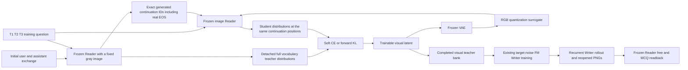

# History-conditioned Prompt Matching: parallel experiment protocol

This is a prospective implementation and evaluation plan. It contains no new
experimental scores and does not replace the existing `hard_ce` default. The
configuration is `configs/experiments/prompt_matching_parallel.json`; archive its
SHA256 before running a comparison. Any later budget, metric, margin or sample
change is a new protocol, not an amendment justified by the observed result.

## What the parallel modes test

The format arm (`A` natural-language response, `B` MCQ response) and supervision
mode are separate dimensions. Keep format fixed when comparing supervision.

| Mode | Teacher signal | Meaning of a comparison |
| --- | --- | --- |
| `hard_ce` (existing default) | Published response in A; official correct option in B | Current task-supervised reference |
| `history_hard` | Exact tokens generated by the frozen Reader given the available initial exchange and training question | Controls for changing the source of the response |
| `prompt_matching` | Full next-token distribution from that same history-conditioned Reader, at those same generated token prefixes | Measures whether soft distribution matching helps beyond the matched hard continuation |

Compare `prompt_matching` against both other modes. A gain over `hard_ce` alone
changes target provenance and softness simultaneously; it does not isolate a
benefit of soft labels. A gain over `history_hard` is the relevant softness
ablation, provided the teacher cache and exact continuation IDs are identical.
The hard companion also incurs teacher distribution extraction; report actual
GPU time and cache size separately. Equal update counts are not equal FLOPs.



The history teacher uses the same image Reader and a fixed gray image as its
reference; the initial exchange is provided as text in the teacher query. It is
not a separately trained text-only teacher. The soft objective is the token mean
of `-sum_v p_teacher(v) log p_student(v)`
at temperature 1. Forward KL differs by the teacher entropy and has the same
student gradient when the teacher distribution is detached. A hard continuation
uses a one-hot target at each identical token position. This is a local
distribution-matching objective on teacher-generated prefixes; it does not prove
equality of the complete autoregressive response distributions.

The Writer still learns the existing official target-noise flow-matching MSE.
It does not backpropagate the Reader loss through a 28-step Writer rollout. The
change is how the visual target is optimized. Consequently, teacher readback
success is an intermediate diagnostic, not evidence of Writer generalization.

## Information and token boundaries

For an initial-write target, the teacher receives only `row['history'][:2]`
(the preference disclosure and its acknowledgment) plus one training question.
The student Reader receives the image plus the same question. The Writer receives
only its actual exchange and prior image. Neither the final question, published
answer, MCQ options nor a teacher continuation is inserted into the Writer input.
In particular, do not use the full 22-message record as the teacher history at an
initial write: the later distractor exchanges have not happened yet.

Use explicit message construction; do not serialize the entire row, whose
`target`, `query`, `benchmark` and `evaluation_only` fields include supervision or
evaluation information. Training is restricted to the fixed pilot/train IDs and
T1/T2/T3. O1/O2, the internal dev rows and official evaluation rows never enter
teacher gradients, target caches, FM targets or checkpoint selection. Retention
sources are actual saved student PNGs produced from the permitted past prefix;
do not substitute the ideal teacher latent as the recurrent memory input.

Token alignment is part of the method, not an incidental tokenizer setting:

1. Preserve generated continuation token IDs. Decoding then re-tokenizing a
   response can change the first token at a chat-template boundary.
2. Teacher and student have different context lengths. Match their logits by
   continuation position, using the causal position immediately before each
   target token; never compare absolute token offsets.
3. Include the model's actual assistant end token once. If generation hits the
   token budget without EOS, reject that teacher target or record it as an
   incomplete diagnostic; do not append a fictitious EOS or promote the endpoint.
4. Keep teacher logits detached and Reader/VAE weights frozen. Student image
   preprocessing must preserve the gradient back to the latent. Compute the
   softmax/log-softmax loss in FP32, with temperature explicitly bound in the
   run metadata. Raw unscaled teacher logits may safely share a cache across
   temperatures; the downstream loss temperature must still be explicit.
5. Bind caches to Reader/tokenizer/template revisions, exact history and query,
   exact target IDs, generation settings, EOS policy and distribution precision.
   The `history_hard` and `prompt_matching` runs must reuse the same matching
   cache. Never reuse a cache across different B option orders.

A teacher can confidently produce an incorrect continuation. Measure its
history-conditioned response quality and entropy on training rows as diagnostics;
do not replace failed teacher answers with gold labels inside only one arm.
Small soft loss or low entropy is not a downstream success metric.

## Minimal paired pilot and scaling

Start with one fixed format arm. The bounded launcher defaults to **B**, whose
short MCQ continuations make initial execution checks cheaper; it does not change
the later free-response promotion endpoint. Preserve the existing hard A and B
configurations. Run all three
supervision modes on the existing **64 pilot training IDs**; no favorable subset
or newly sampled IDs. A short execution smoke is separate and is never evaluated
as a completed 288-step teacher. The data and split authority remains
`reports/prefeval-official-alignment-20260923/WRITER_IMPLEMENTATION_SPLIT.json`.

For the scientific pilot, each latent starts from the same gray-image encoding
and receives 288 Adam updates at learning rate 0.05. Each Writer starts from the
same archived `4fbc857` final checkpoint, identified by the actual checkpoint
SHA256, and gets 2,048 FM updates at effective batch 4, learning rate 0.00005 and
gradient clipping 1. Use the same event sampling and random seeds. Persist the
Reader, VAE and Writer starting revisions and actual training receipts. The pilot
can establish execution, target quality and fit on those 64 training examples;
it cannot establish held-out generalization or authorize replacing the default.

The launcher evaluates the frozen initial Writer on all **90 internal dev IDs**,
with the same two noise chains and actual reopened PNGs. Its MCQ-only, prefix-0
outputs are intentionally insufficient for promotion or the full comparison
utility below. Complete free-response readback/judging and retention checks as
the next separately bounded evaluation. A separate retention stage uses the
same initial/retain sampling schedule in each mode and another 2,048 FM updates;
evaluate the final frozen checkpoint at prefixes 0, 5 and 10. No “best” checkpoint
is selected using O1/O2. New 730-row training experiments must use the complete
registered 730 IDs and the same paired budget within their new protocol; do not
compare a new 2,048-step PM run to an old hard run with more training exposure.

Use the final locked configuration for the **180 official evaluation IDs** only
after this development work. Generate the required initial acknowledgment with
the tested Reader using the official evaluation history contract. Do not create
optimized teachers for those IDs. If results inform another method change, a
subsequent report must disclose that reuse. Existing dev/official records have
prior project exposure and cannot be described as research-naive. Distinct IDs
also do not guarantee disjoint text: disclose the existing exact-content overlap
audit rather than silently dropping unfavorable or duplicate cases.

## What to report and when to consider promotion

Evaluate **all five question forms**, both free and MCQ tasks, and memory, blank,
same-topic mismatch and text controls. Keep the existing deterministic MCQ option
order/parser and fixed generation budgets: 300 tokens for free response, 32 for
MCQ. Free response uses the existing four-part PrefEval judge; pin its exact model,
provider, thinking mode and budget across both arms. A substitute judge remains
labeled a substitute. Pending or malformed judgments are incomplete evidence,
not automatically wrong and not silently omitted.

The preregistered primary endpoint is **free-response O1 AND O2 correctness on
the same PNG at prefix 0**. Average the two chain outcomes within a preference;
the independent resampling unit is the preference ID. The comparison utility
uses 10,000 paired bootstrap resamples with seed 20261005 and reports 95%
percentile intervals. MCQ, free response and different prefixes remain separate
metrics. A repeated wording or noise chain does not increase the independent
sample count. O1/O2 test held-out wording of the same intent, not novel semantic
tasks. Full per-form scores remain available from `summarize_prefeval_k1.py`.

The prospective evidence gates are:

- A held-out **student** retention evaluation is complete on the entire split;
  a pilot, teacher endpoint or initial-only evaluation cannot satisfy this gate.
- The primary candidate-minus-reference interval has a strictly positive lower
  bound. Compare PM with both the current hard reference and `history_hard`.
- Every other memory endpoint (task × prefix) has a delta interval lower bound
  at least -0.02. This two-percentage-point tolerance is chosen prospectively;
  it is not estimated from retired scores. Small samples may be inconclusive.
- Candidate memory exceeds both blank and mismatch controls with positive lower
  interval bounds on the primary task at prefixes 0 and 10.
- Review truncations, parsing failures, efficiency, PNG behavior and official
  evaluation evidence; retain the original paths and checkpoints for rollback.

Intervals are marginal descriptive intervals, not a familywise error guarantee.
Repeated experiments, format-arm selection and repeated use of dev/official data
need disclosure and fresh confirmation. Passing all computed gates produces
`eligible_for_promotion_review`, **never an automatic main/default switch**. The
authorized executing agent can complete the evidence review and decide whether
the conditional replacement criterion has been met; this protocol does not add
a separate user-approval requirement. A gain
seen only with the local training Reader does not demonstrate cross-Reader
transfer. Such a claim requires sending the same frozen PNG, with no target-model
feedback or tuning, to a different image Reader under a separately locked test.
A remote text judge is not that Reader.

## CLI hooks and comparison manifests

The Linux two-GPU launcher provides a bounded execution path. Substitute the
actual installed paths, use separate smoke/pilot outputs and keep its wall-clock
limit explicit. Start with `--dry-run` to record the exact command plan, then omit
that flag to execute from a clean committed checkout:

```text
python scripts/inspire/run_prompt_matching_parallel.py \
  --phase smoke --arm B \
  --base /path/to/dreamlite-base --reader /path/to/qwen3-vl-reader \
  --prefeval /path/to/prefeval --official-source /path/to/official-writer-source \
  --checkpoint /path/to/4fbc857-checkpoint-final.pt \
  --output /path/to/runs/pm-smoke --max-hours 1 --dry-run
```

Use `--phase pilot --output /path/to/runs/pm-pilot --max-hours 8` with the same
model/source arguments for the registered bounded pilot. Smoke optimizes one
training example for 12 steps per supervision mode. Pilot optimizes all 64
teachers for 288 steps, trains each Writer for 2,048 updates, and generates the
MCQ teacher/student readbacks described above. The three modes are scheduled on
two GPUs with command receipts and a shared history-target cache. Neither phase
is a full promotion run, and neither evaluates the 180 official test rows.

The teacher script accepts `--supervision hard_ce|history_hard|prompt_matching`;
omitting it preserves `hard_ce`. For the two history modes, give the same
`--teacher-cache` directory and matching generation settings. Writer training
uses `--teacher-supervision` to select and validate the corresponding completed
teacher bank. Use different teacher and Writer output directories for every
format × supervision combination. The existing K1 evaluator/judge JSONL/JSON
formats are consumed directly by the comparison tool.

```text
python scripts/reporting/compare_prompt_matching.py \
  --baseline-manifest runs/history-hard/dev-comparison-manifest.json \
  --candidate-manifest runs/prompt-matching/dev-comparison-manifest.json \
  --protocol configs/experiments/prompt_matching_parallel.json \
  --output runs/comparisons/history-hard-vs-pm-dev.json
```

Create each readback manifest **before examining results**, keeping it with the
run. Its schema is `vision_memory.prompt_matching_readback.v1`. Relative paths
resolve from that manifest's directory. Record these required fields:

| Fields | Required contents |
| --- | --- |
| `label`, `supervision`, `format_arm` | Distinct run label; one of the three modes; A or B |
| `split`, `endpoint_kind` | pilot/train/dev/official; teacher or student |
| `training_stage`, `evaluation_phase` | pilot or train; initial or retention |
| `expected_ids`, `training_ids` | Complete exact registered split and training-stage ID lists |
| `selection_ids` | All IDs used for within-run checkpoint/hyperparameter selection; training-side only; `[]` if none |
| `reader_revision`, `tokenizer_revision` | Immutable resolved model/tokenizer revisions, not mutable model aliases |
| `chat_template_sha256`, `dataset_sha256`, `history_sha256` | SHA256 of archived template, canonical dataset artifact and evaluated history artifact |
| `history_protocol` | Exact `history_protocol` string carried by the K1 readbacks |
| `writer_base_sha256`, `checkpoint_sha256` | Actual archived starting and evaluated checkpoint hashes |
| `training` | Exact copy of the prospective protocol's `training` object, backed by run receipts |
| `protocol_sha256` | SHA256 of the exact protocol file supplied to the comparison command |
| `readback_files` | Explicit list of all evaluated `readback-*.jsonl` files, not a mutable wildcard |
| `judge_dirs` | List of directories containing the corresponding existing judge JSON records |
| `judge` | Object with exactly `judge_model`, `model_label`, `provider`, `max_tokens`, `enable_thinking` |

The tool rejects mismatched split, format, training budget, Reader, history,
question, MCQ option order or judge settings; missing pairs; incomplete judges;
conflicting duplicates; partial registered splits; and different question forms
reading different PNGs at the same endpoint. It recomputes MCQ correctness using
the upstream parser. Blank is reused from prefix 0 / chain 0; text has one row per
prefix; memory and mismatch have both student chains. It reports provenance
hashes, all control comparisons and truncation counts. These hashes bind supplied
artifacts; they do not independently attest that declared training was executed.

No run or result is present merely because this protocol and its unit tests
exist. The comparison tests use synthetic records to verify failure behavior and
paired statistics, not historical results as evidence of improvement.
