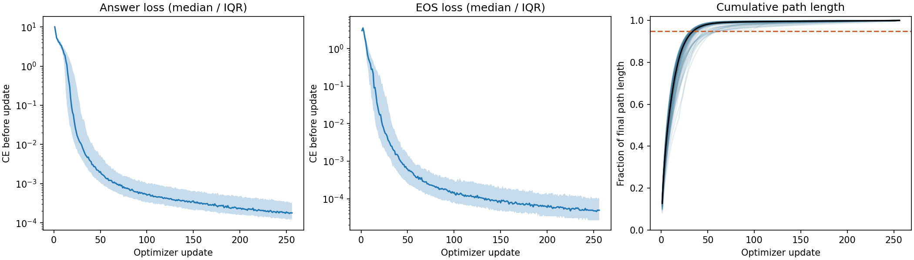
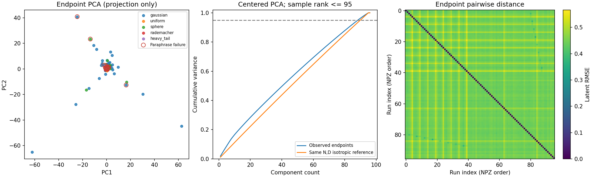
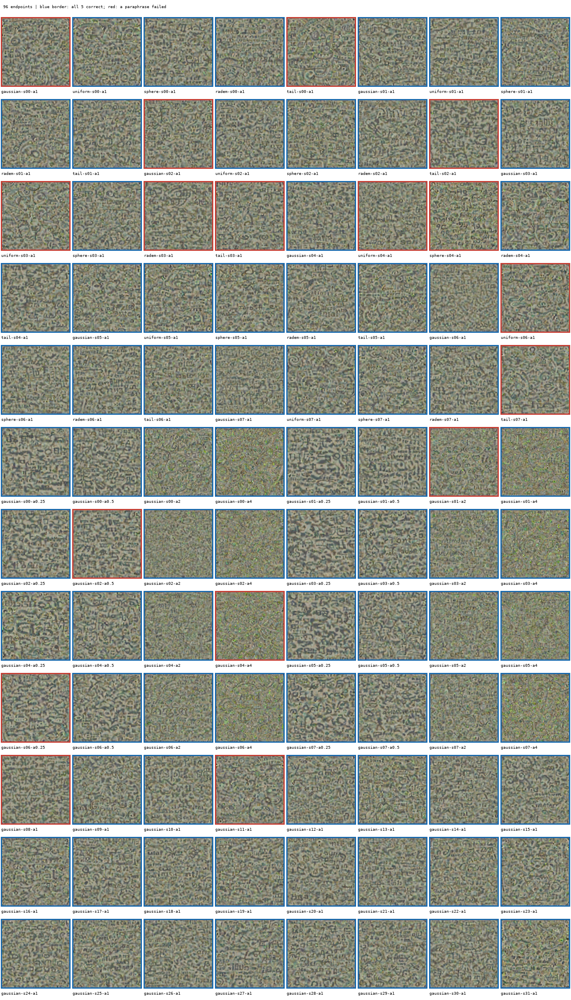

# 原 Direct：完整96条结果与数据记录

本报告对应原单问法 Direct 实验，训练提交 `0f704178137ee4beac952224f3175a3923d5e438`，不混入新三问法轮换实验。原实验完成时间（北京时间）：2026-09-08T23:17:47.015223+08:00。导出时间：2026-09-08T17:13:34.665202+00:00。

**96/96条全部完成，原问法96/96完整答对；五种问法全部正确的终点为79/96。** 96个终点中有96个不同的latent。480条matched终点评测全部具有正确答案前缀，17条完整答案失败均发生在正确的ambient之后继续生成内容。

## 实验究竟验证什么

同一道ambient事实，96个不同初始final latent，各进行256次更新；训练只用original_open，四个改写仅评测。固定灰图编码中心，`z_init = reference + 0.1 × scale × RMS(reference) × epsilon`。仅latent可训练，FP32 VAE和BF16 Qwen冻结；Adam学习率0.05，损失为答案CE＋EOS CE，EOS权重1。该阶段不执行U-Net。

96条由40条五分布比较、32条额外Gaussian scale比较、24条额外Gaussian起点组成，共享单元只训练一次。所有问法保留相同的两行图片使用/短答案指令。

## 完整答题结果

| 问法 | 完整答对 | 正确答案前缀 | 多余续写 |
|---|---:|---:|---:|
| original_open | 96/96 | 96/96 | 0 |
| paraphrase_1 | 96/96 | 96/96 | 0 |
| paraphrase_2 | 95/96 | 96/96 | 1 |
| paraphrase_3 | 96/96 | 96/96 | 0 |
| paraphrase_4 | 80/96 | 96/96 | 16 |

完整正确使用原始greedy生成（最多32个新token）评分，不截取第一个词替代完整答案。全部失败明细见[failed_answers.csv](failed_answers.csv)。

## 配对初始化分组

分布比较固定scale=1、seed0–7，每格8条；不能把所有64条Gaussian与其他每类8条直接混为平衡比较。

| 分布 | 条数 | 原问正确 | 五问全对 |
|---|---:|---:|---:|
| gaussian | 8 | 8/8 | 6/8 |
| uniform | 8 | 8/8 | 5/8 |
| sphere | 8 | 8/8 | 7/8 |
| rademacher | 8 | 8/8 | 7/8 |
| heavy_tail | 8 | 8/8 | 4/8 |

幅度比较固定Gaussian、seed0–7，相同seed复用噪声方向。

| scale | 条数 | 原问正确 | 五问全对 |
|---|---:|---:|---:|
| 0.25 | 8 | 8/8 | 7/8 |
| 0.5 | 8 | 8/8 | 7/8 |
| 1 | 8 | 8/8 | 6/8 |
| 2 | 8 | 8/8 | 7/8 |
| 4 | 8 | 8/8 | 7/8 |

## 轨迹及几何

每条的累计路径长度由各步update RMSE相加得到。走完最终累计路程95%的步数范围为31–66，中位数35；这是移动距离比例，不是训练完成度。前两幅曲线展示96条的中位数与四分位区间；对数坐标仅为显示将非正值裁到1e-9，原始数据不改。

原汇总的终点中心化PCA达到95%方差需要89个分量，位移需要89个分量。PCA只显示有限样本几何，样本秩上限95，不据此认定存在语义簇、低维流形或唯一正确编码。右图为原始终点两两RMSE，顺序与NPZ中的run_ids一致。

蓝框表示五问全对，红框表示至少一个改写失败；单独PNG位于对应run目录。PNG是8位展示图，不能替代评测时的浮点RGB。完整latent保存在NPZ中，可在锁定VAE环境重建浮点图片。

## 科学结论及边界

- 本题96个已测试起点都能通过直接优化找到原问法可读的终点，说明可读终点不唯一；这不是整个latent空间可达性的证明。
- 换问法失败在本批全部表现为正确答案后的续写。事实答案前缀的迁移强于停止行为的迁移；不能笼统称为全部改写都读不出记忆。
- 每种分布/幅度的平衡单元仅8个起点，仍为同一事实，不支持跨题、跨事件泛化结论。空白/固定donor原始评测均完整保留，但相同控制图的重复生成不算新的独立样本。
- 本报告是Direct优化结果；不把它当作DreamLite/U-Net已学会生成记忆的证据。

## 上传内容与复核

| 内容 | 数量/文件 |
|---|---|
| 完成轨迹 | 96条 |
| 每步训练指标 | 24,576条metrics记录 |
| 终点生成 | 1,440条，96×5问法×3图片条件 |
| 检查点生成 | 1,056条，96×11个检查点 |
| latent/checkpoint索引 | 24,672条latent索引、1,056条checkpoint索引 |
| 初值和终点 | [endpoints_and_initials.npz](artifacts/endpoints_and_initials.npz)，96对FP32张量，含run_ids |
| 原始汇总 | [summary.json](artifacts/summary.json) |
| 逐条便览 | [per_run.csv](per_run.csv)、[analysis.json](analysis.json) |
| 完整原始记录与96张终点图 | [artifacts](artifacts/) |
| 文件SHA清单 | [artifact_manifest.json](artifact_manifest.json) |
| 本地复核结果 | [integrity_check.json](integrity_check.json) |

已逐文件复核980个导出文件SHA；NPZ内192个初值/终点张量逐一匹配原manifest/terminal的canonical SHA；全部2496条原始生成使用原评分器重新核对，逐run汇总与原summary一致。原始JSON/JSONL保持字节不变，重算结果放在单独文件中。

**未上传的大体积文件：** 每一步latent的`.pt`、带optimizer/RNG的checkpoint、`endpoint_raw.pt`内完整浮点图片、其他步骤PNG和控制图tensor。这些仍完整保存在启智，不能把GitHub记录包称为所有二进制训练文件的镜像。原始tensor文件路径与SHA见逐run的latent_index/checkpoint_index/terminal。

启智原始根目录：`/inspire/ssd/project/exploration-topic/czxs26210936/runs/direct-latent-geometry/0f70417-20260908-r01`。原执行有dl-base与trust两个阶段，保留原launch/current_execution等记录；不因这次上传重写历史。读取NPZ时按run_ids关联逐run记录，endpoint/initial每行reshape为`(1,4,128,128)`。

运行`python build_report.py`可重新检查上传文件并生成图表；使用本仓库模块及NumPy/PyTorch/Matplotlib/Pillow。CPU报告构建环境用于读取和制图，不是原训练环境；原模型/依赖绑定见lane manifest。

## 17条失败原始输出

| run | 问法 | 完整原始回答 |
|---|---|---|
| direct-gaussian-s00-a1 | paraphrase_4 | `ambient synthwave` |
| direct-heavy_tail-s00-a1 | paraphrase_4 | `ambient synthwave` |
| direct-gaussian-s02-a1 | paraphrase_4 | `ambient synthwave` |
| direct-heavy_tail-s02-a1 | paraphrase_4 | `ambient synthwave` |
| direct-uniform-s03-a1 | paraphrase_4 | `ambient synthwave` |
| direct-rademacher-s03-a1 | paraphrase_4 | `ambient trance` |
| direct-heavy_tail-s03-a1 | paraphrase_4 | `ambient synthwave` |
| direct-uniform-s04-a1 | paraphrase_2 | `ambient, contemplative, reflective, and spiritual` |
| direct-sphere-s04-a1 | paraphrase_4 | `ambient synthwave` |
| direct-uniform-s06-a1 | paraphrase_4 | `ambient synthwave` |
| direct-heavy_tail-s07-a1 | paraphrase_4 | `ambient synthwave` |
| direct-gaussian-s01-a2 | paraphrase_4 | `ambient trance` |
| direct-gaussian-s02-a0.5 | paraphrase_4 | `ambient synthwave` |
| direct-gaussian-s04-a4 | paraphrase_4 | `ambient synthwave` |
| direct-gaussian-s06-a0.25 | paraphrase_4 | `ambient synthwave` |
| direct-gaussian-s08-a1 | paraphrase_4 | `ambient synthwave` |
| direct-gaussian-s11-a1 | paraphrase_4 | `ambient synthwave` |
