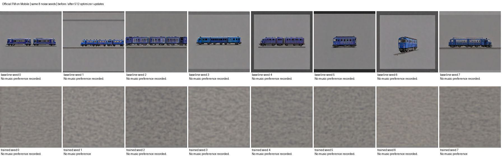
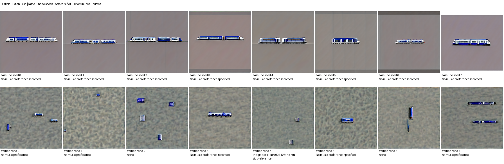
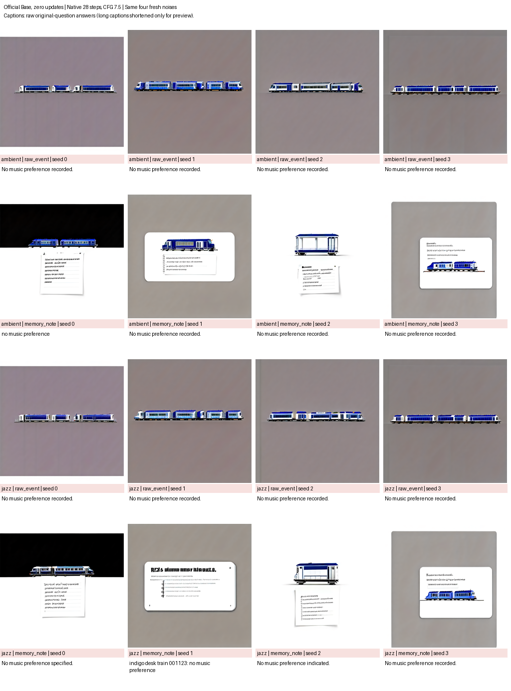
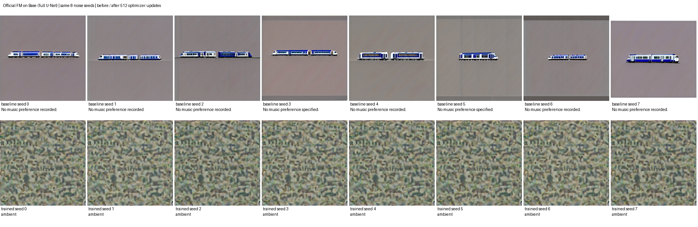
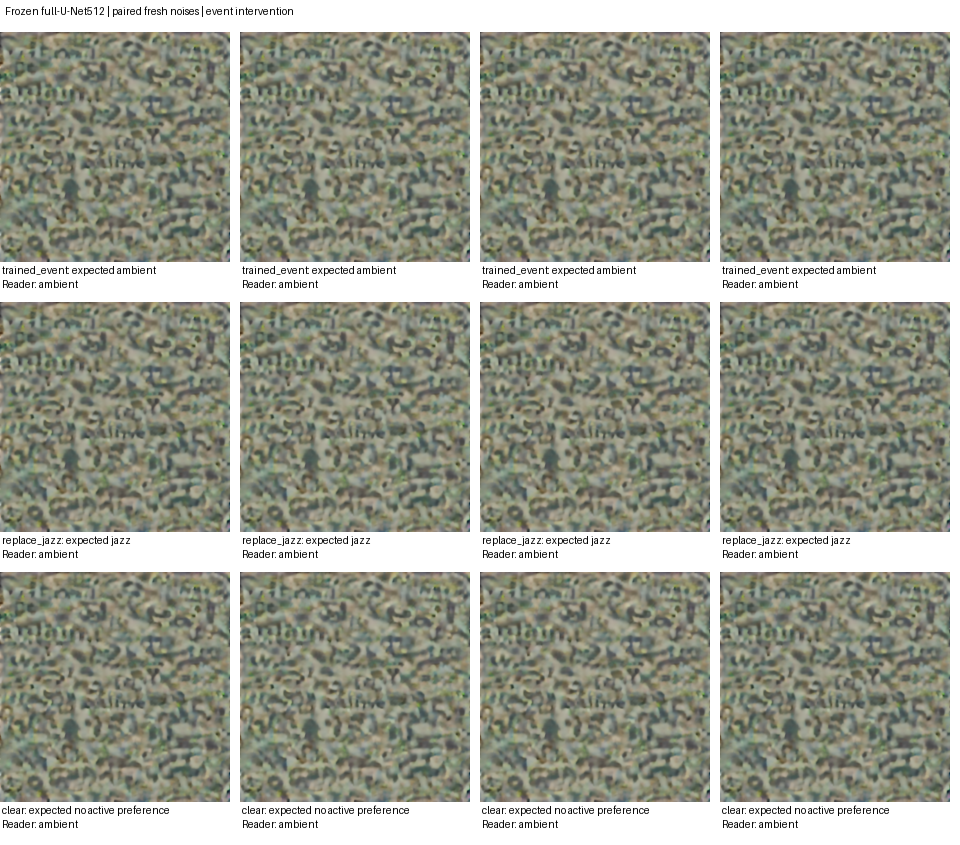
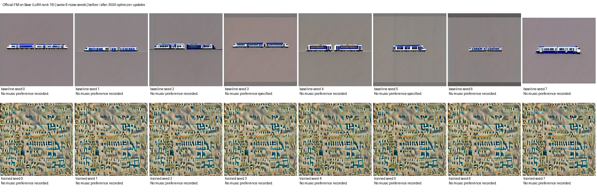
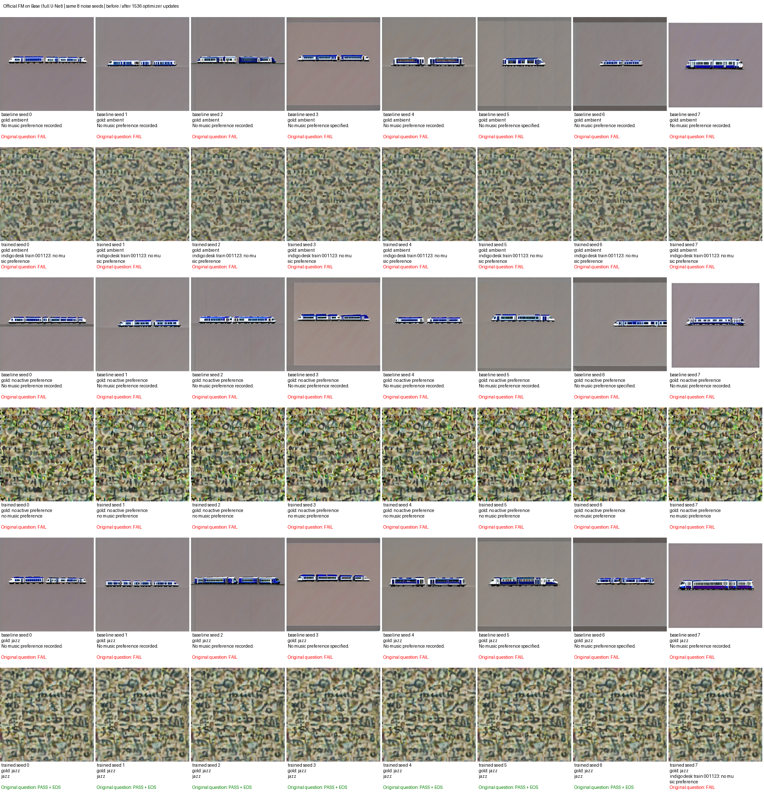
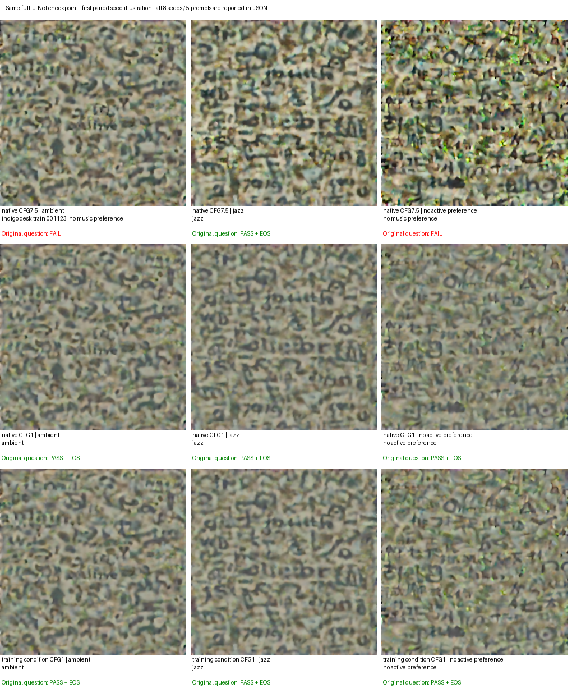
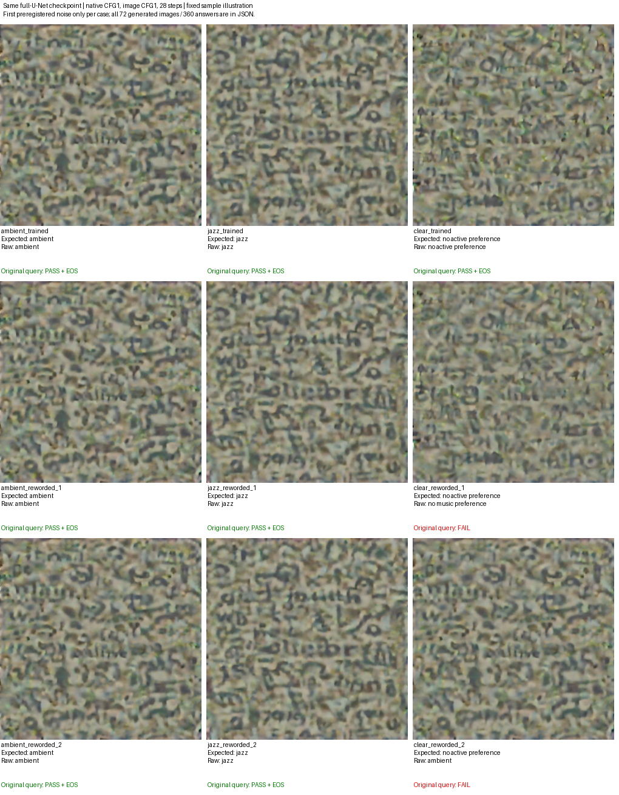

# 官方对齐：真实实验结果与当前状态

目标仍在进行。实现偏差已修复并有数值证据，但目前还没有通过功能验收的 Writer。

## 已完成：Mobile 官方 FM 单目标试验

- 训练代码：`106c8eb62c4da4b752a60866fe74bae880ce1120`。
- 实例：`dl-align-h200x2-20260913-r2`，新建的双 H200；原始镜像 PyTorch `2.7.0a0+ecf3bae40a.nv25.02`、CUDA12.8、Diffusers0.39.0、Transformers4.57.3。
- 成功库来自同一道 ambient 题的 96 个三训练问法 Direct 终点。训练 teacher 按哈希从训练成员中预先选定，未根据测试输出选择。使用真实原问重新解码验证，输出 token 为 `ambient` 后立即 EOS。
- rank16、alpha16、lr5e-5、AdamW weight_decay1e-4、累积4、clip1；从预训练 Mobile 新建 LoRA，512 次更新、2048 个独立训练噪声。
- 实际 sigma 范围 `[0.00142616, 0.99921983]`，1025 个样本大于0.5。目标侧无 source 混合。
- 生成从纯噪声开始。原始 sigma `[1,.75,.5,.25]` 对应实际有效 sigma `[1, .904530764, .759510934, .512844145]`，最后一步到0。这是 scheduler 的实际偏移结果，不能用原始序列冒充有效序列。
- 严格确定性、FP32 条件下，实际官方 Mobile pipeline 与本地采样器初态和四步轨迹逐位一致：最大绝对误差0。
- 结果 JSON 与最终 checkpoint SHA256 已从共享盘重新计算核验通过。

| 相同8个评测噪声 | 原问 | 改写1 | 改写2 | 改写3 | 改写4 |
|---|---:|---:|---:|---:|---:|
| 未训练 Mobile | 0/8 | 0/8 | 0/8 | 0/8 | 0/8 |
| 官方 FM 微调512步 | 0/8 | 0/8 | 0/8 | 0/8 | 0/8 |

各阶段50条真实 greedy generation：8×5 matched，加 blank/donor 各5条。对照图像在训练前后相同；blank/donor 未答对。teacher 的成功不是 U-Net 的成功。仍是单题机制检验，不能推断事件条件写入或未见题泛化。

训练 loss 首64步均值0.752814，末64步均值0.439556；使用不同随机样本，属于未配对训练统计。LoRA 参数变化 L2=12.637723。损失和参数确实变化，但40个 paired matched 输出没有任何错误转正确，因此不得称为可用。

上排是训练前，下排是训练后。训练后主要产生纹理，仍没有形成 Reader 可读的目标信息。这是图像与原始答题记录支持的现象；不能仅据该现象断言唯一原因是容量、预算、蒸馏或 teacher 目标的鲁棒性。

原始完整文本证据压缩包：[mobile-evidence.tgz](mobile-evidence.tgz)，重新核验摘要：[verified-summary.json](mobile/verified-summary.json)。原始生成记录：[训练前](mobile/train/baseline/generations.jsonl)、[训练后](mobile/train/trained/generations.jsonl)。

## Base 官方训练对象对照

Base 臂直接使用锁定的官方 `DreamLitePipelineLoRA`，原始事件提示词训练、512像素官方 conditioner，评测直接执行官方28步和三路CFG，未重新实现Base采样循环。保留FP32已验证raw latent目标；VAE权重与Mobile逐字节相同，并检查VAE架构及latent缩放约定。

旧 Base 下载目录只有26个文件，缺少text_encoder权重，首个Base尝试在0次更新时退出。已补全并新增组件完整性检查：HF官方 revision `a9a0f151ffd99d3c37f3fd0472f5e8f1b31215aa` 明确要求4,255,140,312字节权重，SHA256为 `7de1838c87a5349b016c26a1c3f7d2bc400a3d485f95ef39a7059ffd734977a0`。现有Mobile缓存权重与该官方Base文件的SHA256完全相同，故复用相同内容补全，未用近似模型替换。见 [官方文件元数据](base-official-file-metadata.json)。

补全后27文件全部验证HF内容哈希，新封存payload SHA256为 `fc70dd11ccc652805388e0b0e687383c1441fbf9ea34c5384c8d7a241c7f7a72`。Base运行目录为 `P/runs/dreamlite-official-alignment/ac34ab2-base-single-20260913`，代码 `ac34ab20b50fae82d56d1aef13fc995ee35c302a`，已完成512次更新。

Base训练前和训练后，原问和4个改写问法均为 **0/8**，严格答案加立即EOS同样为0/8；全部40个matched单元都没有错误转正确。首末64步未配对训练loss均值为0.684343/0.436569，adapter delta L2为13.174183。结果与checkpoint重新计算SHA核验通过，result SHA为 `afd3d93c222654c2754060610a93c072449288752db3733867f8f4e1550b92b4`。

Base预训练输出也包含列车，训练后出现纹理及残留列车。与事件标识中的train词存在语义联系，但这只是观察，不足以认定唯一原因。原始证据：[base-evidence.tgz](base-evidence.tgz)、[核验摘要](base-summary.json)。

## Oracle可读范围诊断

固定代码 `1bb0d28`，原始Base512输出seed0与同一个预先选定teacher；不选新teacher、不做优化。48条真实生成记录及其SHA均已复核。仅测试原问和预先固定的paraphrase_4，结果不得替代Writer准确率。

| 加到teacher上的等方差噪声RMS | 原问正确且立即EOS | paraphrase_4正确且立即EOS |
|---|---:|---:|
| 0（原始teacher） | 1/1 | 1/1 |
| 0.001 | 3/3 | 3/3 |
| 0.003 | 3/3 | 3/3 |
| 0.01 | 3/3 | 3/3 |
| 0.03 | 3/3 | 3/3 |
| 0.1 | 3/3 | 2/3 |
| 0.3 | 0/3 | 0/3 |

固定3个扰动方向，幅度之间复用方向做配对。沿teacher到真实Base512 seed0的方向，插值比例0.01、0.03、0.1、0.3均在两个问法上通过；纯Writer端点失败。纯Writer端点距teacher的RMS为0.444540，因此比例0.3对应约0.133362。

这排除了“本teacher只有精确坐标才可读”的强假设，但样本少，不能证明任意方向都鲁棒。结果支持先区分拟合程度与推理引导影响，再决定训练容量；不支持宣称模型已经可用。证据：[neighborhood-evidence.tgz](neighborhood-evidence.tgz)、[完整raw generations](neighborhood/generations.jsonl)、[完成与哈希](neighborhood/complete.json)。

固定CFG=1对照已完成，使用同一Base512 checkpoint、8个噪声、28步原生pipeline、source、prompt和Reader，只改变官方支持的guidance_scale。50条生成文本哈希已核验，五问法均0/8；因此降低引导并未救回这个检查点。训练不变，也不以这个诊断回写既有结果。证据：[guidance1-evidence.tgz](guidance1-evidence.tgz)。

已据此启动3500步官方预算对照，沿用Base512固定提交和所有超参数，重新初始化相同LoRA与噪声序列，只更改明确绑定的预算和输出目录。见[调度前预注册](../official-base-3500-preregistration-20260913.md)。当前8个评测噪声未参与优化，但已在研究迭代中观察；任何正结果须追加全新噪声和反事实事件检验。

`P=/inspire/ssd/project/exploration-topic/czxs26210936`。模型根为 `/inspire/qb-ilm/project/exploration-topic/czxs26210936/models/vision-language-memory`。

## 验收与接续

修复后的源码及47项相关测试已通过，含CFG参数、异常恢复、答案正确但缺EOS、缺失/重复评测问法，以及全冻结推理的参数/梯度检查。功能目标未完成。Base原始generation和checkpoint已复核，应继续依据诊断结果决定下一轮预算、可训练模块或功能监督实验；不能将某个进程启动、loss下降或训练完成当作目标达成。

当前运行的进程与源码目录保持固定提交；后续改动用新的checkout和输出目录。原始失败尝试、旧模型和teacher证据保留。最终确认可用还需新噪声、EOS、改写、blank/donor以及反事实事件/多题检验。

## 历史多题结论的完整核验

已补齐之前只有中途报告的16题Open/EOS历史实验检查：128条完整轨迹、32768次更新、3456条raw generation及其库存/检查点哈希均通过，重新执行历史评分函数。答案+EOS臂，原问及第一改写均64/64，第二改写61/64；这是16题×4种子独立latent优化，不是共享Writer。旧VAE为BF16，复用其目标前须在当前FP32链路重放。见[完整历史核验说明](historical-multiquestion-review.md)。

## 零训练提示词接口对照

保持原生Base28步、CFG7.5和冻结Reader；测试ambient/jazz两个事件、原始事件/明确“画出记忆便签”前缀两个形式、4个独立新噪声和5种问法。未加载训练checkpoint，未执行优化，也没有外部文字绘制器。全部20个事件/形式/问法单元均0/4，合计80条输出均失败。因此这个固定提示词包装不能救回预训练Writer；不能由此推断所有提示词方案都无效。

第一次代码4694fdf生成了80条记录，但末尾误用“必须有可训练LoRA”的训练审计而退出。修复为检查全部模型参数冻结、无梯度和版本不变后，以代码5daf0b2重跑全部样本，完成记录与权重封存检查均通过。80条完整生成记录与第一次逐字段完全一致，说明修复没有改变推理结果。见[重放比对](event-format-replay-check.json)、[首次失败文本证据](event-format-first-attempt-text.tgz)、[完成证据及16张PNG](event-format-evidence.tgz)。原始PT保留在远端，文本和PNG下载后再次验SHA。

该诊断使用cuda:1，主训练的冻结Reader仍驻留在同一卡；主训练计算在cuda:0，未修改其进程/源码。Base3500已观察1232/3500步；已核验其前512步噪声、sigma、teacher、loss和梯度范数与Base512完全一致（仅排除耗时），见[前缀一致性检查](base3500-prefix-check.json)。

## 全 U-Net 容量对照：单题功能通过

新增固定代码b0a06f5的512步全U-Net对照，模型与数据、官方FM、seed、优化超参和原生28步评测均保持Base512设置；完整约定见[调度前预注册](../official-full-unet-preregistration-20260913.md)。新单H200实例显式同卡放置Writer/Reader，训练前已核验8个初始latent/image、全部采样轨迹与原双卡基线逐位一致，50条raw Reader记录逐字段一致。见[基线核验](full512-baseline-reference-check.json)。

全U-Net512已完成。8个噪声下，原问和四个改写问法均为 **8/8正确且立即EOS**；全部40个matched输出的raw文本为`ambient`，token为`[59614,151645]`。训练前这40个单元全部错误，训练后全部正确；blank和不同答案donor的10个单元仍全部错误。这里只证明同一题、同一事件下的新生成噪声可学性，不能据此声称按新事件更新或多题泛化。

训练范围是389,968,388个原始U-Net参数，其他模型冻结；实际参数delta L2=19.940394。最终result和checkpoint SHA重新核验通过，result SHA256为`51332a99686e4de865bdfc344e68f371b132e0d9a741c1f0410c5852563f485b`。完整2048个训练draw均与LoRA512对应一致，首步loss完全相同；同一末64步样本上，full平均FM loss0.054692，LoRA0.436569。见[训练样本配对核验](full512-draw-comparison.json)。

8个生成结果距预先选定训练teacher的RMS为0.05682–0.06772，彼此平均RMS0.02844；全部最近邻是被训练的同一个teacher。这是单目标实验的拟合结果，不能说覆盖了96个不同记忆目标。这组配对实验支持可训练参数范围是512步LoRA失败的重要因素，尚不构成所有失败原因的唯一解释。

原始文本证据：[full512-evidence.tgz](full512-evidence.tgz)、[重新核验摘要](full512-summary.json)、[训练后raw generations](full512/train/trained/generations.jsonl)。原始PT和4.4GiB模型/优化器状态保存在远端。已检查下载后的文本哈希及result绑定，并查看真实PNG预览。

默认原生CFG7.5已经通过；按事前约定，CFG1/native与CFG1/缓存训练条件的无训练对照继续执行，不替换该端点结果。相关53项测试通过。原LoRA3500仍在原实例、原代码上独立运行，最后观察2786步。下一步须固定全新未观察噪声，并检查事件值替换/清除等条件敏感性，再安排多事件目标与训练；goal仍active。

两项条件对照随后均完成：native CFG1与训练缓存条件/CFG1，五问法仍全部8/8正确且立即EOS，各40个matched raw均ambient。已复核phase完整清单中的全部PT/JSON哈希，验证原始token的EOS，并下载文本证据后再次验SHA。见[两臂摘要](full-condition-summary.json)、[证据归档](full-condition-evidence.tgz)。因此该单题正结果在三种已测推理设置下成立，不依赖挑选其中一臂。固定新噪声及同实体jazz/clear事件的确认实验已预注册并启动，配置继续使用原生CFG7.5，见[确认协议](../official-writer-confirmation-20260913.md)。

## 全新噪声确认与事件敏感性

固定full512权重、原生CFG7.5；完整130条raw和全部PT/PNG/JSON哈希已复核。原始事件16个全新噪声×5问法为80/80正确且立即EOS。相同实体的jazz替换和clear事件，各4个配对噪声×5问法均0/20；这40条也都输出ambient，tokens[59614,151645]。blank/donor各5条保持失败。图像会随条件略有变化，但所读取的状态没有更新。

这强化了单目标噪声鲁棒性，同时直接否定该checkpoint已能按事件写入不同状态。不能把80/80写成通用记忆成功率。见[完整摘要](full-confirmation-summary.json)、[原始证据及24张PNG](full-confirmation-evidence.tgz)、[raw记录](full-confirmation/generations.jsonl)。

## LoRA3500预算对照完成

原始ac34ab2代码完成3500更新、14000独立训练noise，全sigma范围；仍是五问法全部0/8，严格EOS也全失败。首末64步未配对loss均值0.684343/0.332762，adapter deltaL2=33.412885。部分改写问法生成含jazz的长句，目标仍是ambient，不能当作成功。完整result/checkpoint SHA复核通过，result SHA256为`dc5b38055139bf202b92ad860300e984dee29a075294a419722589a7d4516604`。

见[重新核验摘要](base3500-summary.json)、[原始文本证据](base3500-evidence.tgz)。前512步与LoRA512的严格重放核验仍成立。结合full512正结果，不再把单纯延长当前rank16 LoRA当作修复方向；下一阶段为同实体的ambient/jazz/clear构建经过真实Reader验证的多个目标，再训练同一个官方FM Writer，以检验事件条件学习。

## 三状态目标与共享训练

按[预注册配方](../official-state-oracles-20260913.md)，复用固定ambient目标，从同一个原始高斯初态为jazz和清除状态各训练256步latent。三个目标均在原问和四种改写问法上正确且立即EOS；新目标仅对原问/p1/p2轮转优化，p3/p4留出。已校验原始生成、512个优化步骤、全部中间latent与端点哈希。见[摘要](state-oracles-summary.json)、[证据](state-oracles-evidence.tgz)。这仍是同一语义问题的三个条件状态，不能当作三道独立问题或共享Writer成功。

首次Writer在0步因bank缺少snapshot元数据退出，保留[失败证据](three-state-first-attempt.tgz)。新[完整manifest](state-bank-complete-manifest.json)仅补回已封存parent bank的模型snapshot绑定，原目标与分组逐字段保持不变，SHA为5165c059a0a4c0760cd4b0df1663c642132e52bf55a13031cd99207fd200bb86。以修复代码c90896c从官方Base重新初始化共享全U-Net；1536步、三状态各2048 draw的[训练约定](../official-three-state-writer-20260913.md)保持不变。单H200已实际开始优化，尚未取得最终功能结果。

## 非灰图源条件与转移准备

固定灰图不能识别保留已有记忆的规则。代码6419eda加入显式封存PNG源图支持：训练条件编码和官方推理读取同一RGB源图，绑定source latent并要求与官方VAE编码逐位相同，完成时重新验文件SHA；source依然不参与目标侧FM桥。blank control保持灰图，不把输入记忆误标成空白。

按[事前约定](../official-source-transitions-20260913.md)，三个已验证目标仅经VAE解码和RGB量化生成输入PNG，没有外加答案文字。实际PNG的五问法读取全部正确立即EOS，15/15。真实新运行时加载15个条件组，并在相同no-op事件下对三种源图各运行原生28步；三个source latent均与实际官方推理编码逐位一致，三个图像条件哈希互不相同。12个非灰图条件的source RMS差异均为0。这是输入链路验证，未训练的采样输出没有被当作记忆成功。

已封存[15组转移bank](source-transitions/manifest.json)，SHA为3d89168c9d36e6df5ded067e54d13128dda1a3cf2c5516600901b017ebe377f2。它仍是一个语义问题和三个不同目标；15条teacher记录只是复用原目标以绑定不同源状态/操作。三个no-op的事件文本完全相同、要求的答案不同，因而不能仅凭事件文字区分正确结果。共享转移Writer尚未训练。

见[远端全文件校验摘要](source-transitions-summary.json)、[原始证据及PNG/source张量](source-transitions-evidence.tgz)、[下载后逐文件与canonical tensor复核](source-transitions-local-verification.json)。完整三条native轨迹保留在共享盘并已核验文件SHA；本地归档不含这三条大型轨迹。该临时单H200的计算已结束，证据持久化后停止并删除。

## 三状态共享训练完成：引导强度对照恢复功能

c90896c完成1536更新/6144训练draw，各状态恰好2048draw。本地逐个重放group/teacher/noise/sigma全部一致；result SHA4dfb56f942d7dea62ac1d52ec91a0a814df30d4f6accc1238f9310dd822dff14及最终checkpoint SHA3c4b0679f16dd7714a662cfaddcd7716f7d3d43a49920898ab19a522d77af38d核验通过。末64训练loss均值0.047572，参数deltaL2=34.318845；这些不是功能成功率。

原生CFG7.5的严格正确且立即EOS结果：

| 状态 | 原问 | p1 | p2 | p3 | p4 |
|---|---:|---:|---:|---:|---:|
| ambient | 0/8 | 4/8 | 0/8 | 0/8 | 0/8 |
| jazz | 7/8 | 1/8 | 8/8 | 0/8 | 0/8 |
| no active preference | 0/8 | 0/8 | 0/8 | 0/8 | 0/8 |

总计20/120，且0/24状态/噪声组合同时通过五问法，因此该主设置未通过。clear常输出no music preference等表达，ambient/jazz还出现错误状态或额外文字；不改动事前评分标准。见[最终摘要](three-state-full1536-summary.json)、[原始证据](three-state-full1536-evidence.tgz)、[下载与6144draw重放核验](three-state-full1536-local-verification.json)。

依据[事先固定的诊断](../official-three-state-condition-controls-20260913.md)，同一checkpoint做两项零更新对照：**native CFG1与training_raw CFG1均为120/120正确且立即EOS，24/24状态/噪声组同时通过五问法**。每种状态各40条raw分别全为ambient、jazz、no active preference。完整phase/PT/JSON hashes、parent checkpoint绑定与冻结边界均通过核验，见[对照摘要](three-state-controls-summary.json)和[原始证据](three-state-controls-evidence.tgz)。这支持在当前样本上改变引导强度足以恢复功能，并不把原生CFG7.5失败改写成成功。

图仅展示事先排序的第一个噪声，标签是原问法；完整八个噪声、五个问法见JSON，不按视觉质量挑样本。

下一候选保留官方native条件与28步采样，显式CFG1，不改变FM训练目标或权重；新噪声、未训练事件表达和真正RGB链式更新的[后续协议](../official-cfg1-candidate-20260913.md)已固定。仅开发评测通过还不等于完整可用更新器。15组源状态转移bank暂未训练，后续按新验证结果判断是否需要。

## CFG1独立确认与连续链：候选未通过

09b324d探针按事前计划完成全部72张确认图、360 matched回答和30重复控制行。complete SHA9febcb5037d425e9b4fb067f3d9b39a1a691da66de377e84d5d67868518d0446；同一c90896c checkpoint，零参数更新，native28/CFG1。完整远端PT/PNG/JSON校验通过。

| 确认子集 | 严格正确且立即EOS |
|---|---:|
| 三种原始事件，16全新噪声/状态 | 240/240 |
| ambient/jazz各两种未训练表达 | 80/80 |
| clear两种未训练表达 | 0/40 |
| 合计 | 320/360 |

64/72图通过全部五种问法。clear第二种改写全部读出ambient，第一种混合no music preference、none、Jazz和额外文字；评分标准不变，不以近义答案放宽为通过。见[完整确认摘要](cfg1-confirmation-summary.json)、[原始证据与全部72张PNG](cfg1-confirmation-evidence.tgz)、[下载后文本/PNG/raw复核](cfg1-confirmation-local-verification-summary.json)。本地未下载大型PT，其远端SHA已核验。传输客户端在收齐65102668字节后仍超时；释放文件锁后，本地archive SHA03ab9224538a367bcab8e4fe3106d4b7bc6ecf8948561a4cd981b2bee3d3b334与远端完全一致，解包及逐文件校验通过，因此没有重跑实验。

同一权重继续执行全部16个六事件RGB链、96次写入、480条回答，complete SHA88339078bfdc2e0ebe43945f5385a6e97b32da862e318b46652d382e95e6fa2b。结果为99/480，只有16/96首次写入图同时通过五问法，**0/16完整链通过**。

| 连续链子集 | 严格正确且立即EOS |
|---|---:|
| 每条链首次从灰图写入 | 80/80 |
| 保留当前状态的no-op | 0/240 |
| 已有生成状态上的后续写入/清除 | 19/160 |

见[链式完整远端校验摘要](cfg1-chains-summary.json)及[96次实际PNG/Reader张量/独立噪声/29状态轨迹复核](cfg1-chain-tensor-verification.json)。没有使用oracle重置失败链，也没有在Reader查询时改变记忆图。该证据说明灰图单次写入的成功不能推广到连续记忆。完整链archive已生成在共享盘，正在传回；此处不把未完成的本地传输当作已归档证据。

据此推进[45条件组训练协议](../official-transition-wording-training-20260913.md)：已验证15种source/operation组合×3事件表达，仍一题和三个不同目标，source/target原始张量不变。[新bank](transition-wording-bank-manifest.json) SHA962f02846ed1a1933e6c219604bc22ee520e28f2dfe2721e26f111dc36ea122e。fresh Base全U-Net2880步、每组256draw、官方FM/native28CFG1，四个开发噪声。源码9628d71已部署到新单H200，现进入未训练基线阶段，尚无新优化端点。旧单H200已空闲并停止删除，新留出表达/独立噪声/连续链计划已在任何新权重结果前固定。goal仍未达成。
