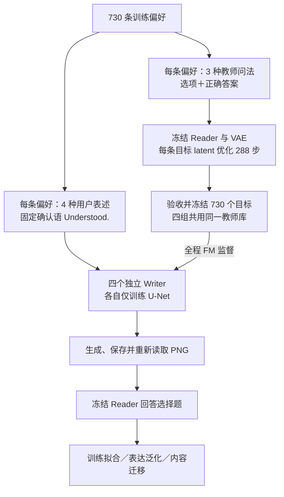

# Writer 语义记忆实验方案：4×3 增强与四组对照

> 部署版 · 2026-10-09 · 修订 3：P 组使用 DreamLite 官方发布的原始预训练 U-Net 权重  
> 本版流程：硬选择题优化教师目标 → 冻结共同教师库 → Writer 全程 FM 训练 → 实际 PNG 读回评价。  
> 状态：2026-10-10 已从 high 实例中断恢复四组 Writer，教师库730条已验收；训练与中间检查点评测继续运行。见 [恢复记录](./RECOVERY-20261010.json)。

## 一、总述：要验证什么，怎样验证

**目标：在相同的增强数据、教师目标和训练预算下，判断 DreamLite 原始 U-Net 预训练、学习率与训练次数，分别怎样影响共享 Writer 的记忆能力。**

从第一性原理看，有效记忆应同时满足三个条件：

| 要求 | 直观例子 | 实验要观察什么 |
|---|---|---|
| 同义变化后仍正确 | “我不吃辣”换成“请避开辣味食物” | 换用户表述、换问题后，仍能读出相同偏好 |
| 意思改变时能区分 | “我不吃辣”改成“我喜欢辣食” | 在可明确区分的题目中，答案随偏好改变 |
| 新内容也能写入 | 输入本轮未训练的另一条偏好 | 无需逐条优化目标图，也能直接生成有效记忆 |

### 1. 整体流程



教师阶段先寻找“Reader 能读懂的记忆”；Writer 阶段学习“根据用户表述自动写出记忆”。教师阶段更新逐条 latent，Writer 阶段更新共享 U-Net 参数。

### 2. 四组只改变初始化和学习率

| U-Net 初始化 | 原学习率 `5e-5` | 大学习率 `5e-4` |
|---|---|---|
| 同一 DreamLite 官方发布的原始预训练 U-Net 权重（Base） | **P-L** | **P-H** |
| 同架构、同配置的标准随机初始化 | **R-L** | **R-H** |

四组均使用完整 W0–W3 × 新 T1–T3。P-L/P-H 起始权重相同，R-L/R-H 起始权重相同；每组使用独立的新优化器。随机初始化遵循架构规则，并非把权重全部填零。

**P 表示使用 DreamLite 官方发布的原始预训练 U-Net，R 表示仅将同架构 U-Net 标准随机初始化。** 两类均使用相同的冻结 VAE、文本编码器和 Reader，因此“随机初始化”只针对 U-Net。

P-L/P-H 的共同起点登记为 `carlofkl/DreamLite-base`，固定发布版本 `a9a0f151ffd99d3c37f3fd0472f5e8f1b31215aa`。既有下载记录对应的远端 U-Net 文件为：

```text
/inspire/qb-ilm/project/exploration-topic/czxs26210936/models/vision-language-memory/DreamLite-base-a9a0f15-20260907/unet/diffusion_pytorch_model.safetensors
```

[既有加载与文件校验记录](D:/2026WorkExperience/VisonLearnableMemory-init-ablation/reports/official-alignment-results-20260913/base/train/runtime.json)中，该 U-Net 权重文件的 SHA-256 为 `f983bd1710344cb44f7d12d05c0ca961984b48391dcbb095ad710609cbde3246`。这属于历史核验依据；正式部署时重新核对实际文件、配置及加载后参数，确认 P-L/P-H 起点相同。R-L/R-H 共享同一配置和随机初始状态，并记录其参数哈希。

本次修订取消 `4f` 任务训练检查点作为起点；四组均不得加载它的训练参数或优化器状态。只保留四组，不增加 `4f` 对照组。

### 3. 五个累计检查点

每条偏好的一次曝光，指它以一种用户表述参与一次 Writer 训练样本计算。effective batch=4 时，每次参数更新累计四个样本。

| 每条偏好累计曝光 | 累计参数更新 | 每种用户表述累计曝光 |
|---:|---:|---:|
| **32 次** | **5,840 步** | 8 次 |
| **64 次** | **11,680 步** | 16 次 |
| **128 次** | **23,360 步** | 32 次 |
| **256 次** | **46,720 步** | 64 次 |
| **512 次** | **93,440 步** | 128 次 |

计算式：`累计更新步数 = 730 × 每条偏好曝光次数 ÷ 4`。

**每组连续训练一次，在五个节点保存和评价；不重置优化器，也不把五档预算相加。** 四组正式训练共 373,760 次参数更新、1,495,040 次样本曝光。教师构建、数值预检和评价成本另计。

## 二、分述：每一步为什么这样设计

### 1. 用等义表达增强，检验对措辞的依赖

每条偏好设置四种用户表述：W0 保留原文，W1–W3 从词汇、句法和自然对话表达等方向改写。三种教师问法中，T1 保留原问题，T2/T3 使用本次增强包中的新改写。

所有改写保持偏好的肯定或否定、程度、条件、范围及答案适用性。问题不能泄露原本需要通过记忆获得的偏好；选项内容与正确答案映射保持不变，选项轮换时同步调整答案位置。

| 数据对象 | 数量 | 含义 |
|---|---:|---|
| 独立偏好组 | 730 | 真正独立的训练内容 |
| 用户表述 | 2,920 | 每个偏好四种写入表达 |
| 教师问题 | 2,190 | 每个偏好三种读取问法 |
| W×T 逻辑配对 | 8,760 | 表述与问法的组合覆盖 |
| 教师目标 latent | 730 | 每个偏好一个共同目标 |

**增强增加表达覆盖，没有把 730 个偏好变成 8,760 个独立偏好。** 划分训练与评价数据时，以偏好内容组为单位，不能随机拆分这些组合。

助手确认语统一为 `Understood.`，训练与核心评价采用相同规则。例如：

```text
User: 我不喜欢含有付费获胜机制的游戏。
Assistant: Understood.
```

这样可以减少模型依赖助手复述来识别偏好的可能性。固定的是 Writer 的输入确认语；Writer 输出的仍然是记忆图像。

### 2. 一个偏好共用一个目标，分开约束写入与读取

教师通过冻结 Reader 的硬选择题交叉熵，直接优化该偏好的 latent；VAE 与 Reader 权重不更新。三种问法轮流参与优化，同一个目标需要适应不同问题表述及答案位置。

本版每个目标固定优化 **288 步**：

`3 种问法 × 4 个正确选项位置 × 每组合 24 次更新 = 288 步`。

这个数值是本版登记预算，不是“必然充分”或“最优”的保证。优化后必须保存并重载真实 PNG，检查训练问法下的正确率，以及匹配图相对错配图、空图的收益。全部 730 条保留，失败项单列，不按教师成绩删除困难偏好。

W0–W3 都学习同一个目标，给 Writer 提供“不同表达对应相同信息”的监督。**用户表述不直接进入当前教师优化；问题也不直接进入 Writer 的 FM 输入。** 因而教师问法不再乘入 Writer 的曝光计数。

本次必须用新 T1–T3 构建共同教师库，并绑定数据与目标哈希。教师库验收后冻结，全程不随 Writer 检查点更新。

评价专用 T* 可在教师冻结后用于诊断，但不得据其成绩调预算、改目标或筛样本。若用某批问题调参，该批问题只能称校准集，不能继续作为最终未见问法评价。

### 3. 控制其他条件，让四组差异可以解释

| 比较 | 回答的问题 |
|---|---|
| P-L 对 R-L；P-H 对 R-H | 同一学习率下，DreamLite 原始 U-Net 预训练是否有收益？ |
| P-H 对 P-L；R-H 对 R-L | 更大的学习率是否改善学习？ |
| 同一组的五个检查点 | 增加训练改善的是拟合，还是泛化？ |

不能只比较 P-L 与 R-H，就把差异归因于初始化，因为学习率也变了。

四组固定以下条件：

- 同一 train730、W0–W3、新 T1–T3、确认语和冻结教师库；只研究首次写入。
- 仅训练 U-Net；VAE、文本编码器和 Reader 冻结。Writer 全程采用现有 FM 监督。
- effective batch=4、float32、AdamW；betas=(0.9, 0.999)、eps=`1e-8`、weight decay=`1e-4`、梯度裁剪 1.0。
- 使用配对的偏好顺序、表述顺序、噪声和 sigma 采样；每个检查点核对逐偏好、逐表述的实际曝光次数。
- 从规定初始权重和全新优化器开始，不从旧数据实验终点继续训练；五个检查点保存推理权重与完整恢复状态。
- P 组仅加载登记的原始预训练 U-Net；R 组按同一配置随机初始化。核对完整加载过程，防止旧入口随后用任务检查点覆盖起点。

正式训练前，各组独立做 128 步数值预检。若 P-H 或 R-H 出现明确 NaN/Inf，两组共同改为 `1.5e-4`，重新初始化后再检查一次。低学习率组保持不变；不根据准确率单独调参。正式训练从各自登记初始状态重新开始，预检成本不计入 93,440 步。

### 4. 用真实 PNG 判断记忆，而不是用训练 loss 代替

所有组使用相同生成种子安排、28 步推理、CFG=1 和同一冻结 Reader。必须保存、重新打开实际 PNG 后读回。

W0–W3、T1–T3 已参与训练，因此另行冻结评价专用 W*、T*，不进入教师或 Writer 优化，也不用于模型选择。

| 评价层次 | 数据与输入 | 评价时间 |
|---|---|---|
| 训练拟合 | train730，原始用户表述与原问题 | 五个检查点 |
| 写入表达泛化 | 固定、按主题分层的训练96条；W*＋T1 | 五个检查点 |
| 读取问法泛化 | 同一96条，用 W0 生成的固定 PNG；问题由 T1 换成 T* | 五个检查点 |
| 联合表达泛化 | 同一96条；W*＋T* | 五个检查点 |
| 内容迁移 | dev90，不为这些偏好优化教师目标 | 五个检查点 |
| 最终留出评价 | official180 | 仅固定 93,440 步终点 |

每项核心评价包含匹配图、同主题错配图、空图与选项位置轮换。另用少量正确答案可明确翻转的相反偏好对，检查答案是否随偏好改变；原偏好直接作为文本输入 Reader 的结果用作诊断参照。

主要报告正确率、匹配图相对错配图和空图的收益，以及换表述、换问法后的变化。按偏好组计算配对统计和置信区间，不把问法、选项轮换或生成种子当成独立偏好样本。

已知有三对训练/官方内容重复：保留 official180 全量结果，另报去重后的 177 条敏感性结果。换用原始权重消除了继承本项目历史任务训练的影响，但 DreamLite、文本编码器与 Reader 的原始预训练数据暴露未逐条核清，dev 仍称“本轮未训练”，不称“从未见过”。

### 5. 用结果定位问题，限定结论范围

| 观察 | 优先检查的环节 |
|---|---|
| 教师 PNG 本身没有记忆收益 | 教师目标、数据监督或 Reader |
| 教师有效，Writer 在训练输入上仍表现差 | FM 拟合、生成过程、优化预算或目标可学习性 |
| 训练表达有效，换用户表述后下降 | 写入表达泛化 |
| 同一记忆图换问题后下降 | 读取问法鲁棒性 |
| 已训练内容稳健，新内容失败 | 内容迁移能力 |
| 曝光增加只改善训练集 | 更多更新尚未转化为泛化收益 |

这些现象用于缩小诊断范围，不是单凭一个指标就能确定因果。

**固定主终点为 512 次曝光。** 其他检查点展示学习过程，不按测试成绩挑选最好的时刻。首轮使用一个配对训练种子，结果作方向性判断；正式确认稳定收益时，使累计配对训练种子至少达到三个。

本版结论有四个边界：

- 四组都使用增强数据，不能单独量化增强相对原数据的因果收益。
- 结论针对指定 DreamLite 原始 U-Net 权重相对随机初始化，在当前数据、教师、学习率和有限预算下的收益；不能推广为所有预训练或所有从头训练配置的结论。
- 文本编码器冻结，研究的是已有文本表示支持下的共享写入，不是 U-Net 独立从零学习语言。
- 同一偏好共用目标有助于统一监督，但不保证不同偏好之间的教师编码容易被共享 Writer 学习；教师读回好也不保证学生能泛化。

### 6. 并行安排与交付状态

| 阶段 | b-cr 实例 | high 实例 |
|---|---|---|
| 教师构建、条件缓存、教师读回验收 | 各阶段用 GPU0–3 | 各阶段用 GPU0–3 |
| 四组 Writer 连续训练 | GPU0：P-L；GPU1：R-H | GPU0：P-H；GPU1：R-L |
| 同时评价已保存检查点 | GPU2–3 | GPU2–3 |
| 各训练卡完成后、最终评价 | GPU0–3 逐步全部加入 | GPU0–3 逐步全部加入 |

两个实例分别为 `prefeval-b-cr-h200x4-20260926` 和 `prefeval-k1-h200x4-high-20260924`。教师8片、条件缓存8片、教师读回24片，均按分片编号奇偶固定均分给两台。Writer 每台各承载一个预训练组、一个随机组，以及一个低学习率组、一个高学习率组，减少机器差异与实验因素重合。

**检查点落盘并完成哈希校验后，立即进入评价队列，无需等到93,440步。** 每个检查点按 train、dev、表达诊断、相反偏好划分生成与读回任务；两台均分每个集合的分片。同一集合的全部PNG生成完成后再做错配读回，避免引用尚未生成的图像。固定最终官方评价等待四组训练全部完成。完整结果自动汇总为各集合的 `summary.json` 和总 `results-index.json`。

评价使用两个生成种子0/1，每道题四个正确选项位置。匹配图与错配图覆盖两种子；空图、直接文本对照不依赖图像生成随机性，只计算种子0。train/dev/official每条24次读回，教师每条48次，表达诊断每条72次；同一偏好的重复观察先聚合，再计算置信区间。相反偏好固定16条，单列诊断。

增强输入已接入独立入口，评价专用96条W*/T*和16条相反偏好已冻结，独立复核后的6处语义偏差已修正。源数据14组歧义保留披露，不删除困难样本。机器复核不等于人工认证，也不等于训练有效性已经得到证明。

两台已对35个模型文件独立完成全量哈希核验，资产清单一致。四份实际GPU初始化核验已通过：跨实例P组初始参数相同，R组初始参数相同，P与R不同。教师PNG验收后才放行四组128步数值预检与正式训练。高学习率回退、固定初始化和累计曝光核验由程序执行。

旧实验进程按用户要求直接终止，保留已落盘产物。新代码使用独立只读版本、新运行目录和新优化器，不继承旧训练终点。新入口没有4f权重依赖。卡数只用于并行独立任务，不改变batch、随机流和正式更新预算。

## 三、核验依据

- [机器可读实验协议](D:/2026WorkExperience/VisonLearnableMemory-init-ablation/reports/prefeval-aug4x3-init-ablation-exposure512-20261009/PROTOCOL.json)
- [增强数据清单](C:/Users/Expedition/codex_work/prefeval-augmentation-4x3-20261008/manifest.json)
- [增强数据校准记录](C:/Users/Expedition/codex_work/prefeval-augmentation-4x3-20261008/reports/validation_summary.json)

协议标识：`prefeval-aug4x3-init-lr-exposure512-20261009`。本文件整理用户选定的固定教师、全程 FM 版本；直接 MCQ 微调、动态教师和教师步数校准属于另行讨论的候选方案，未并入本版。
