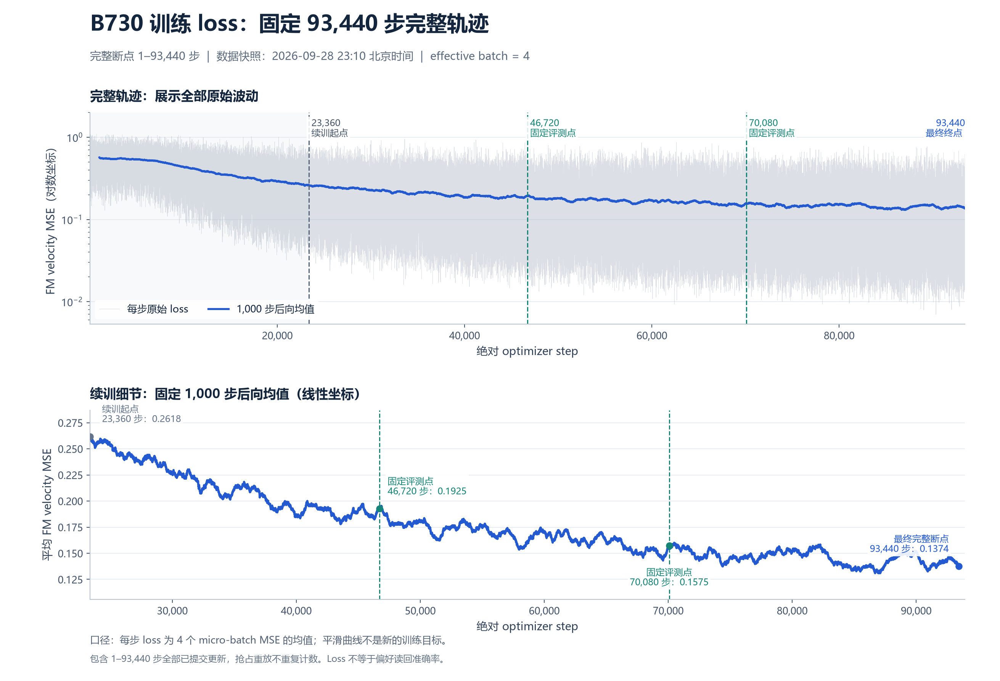

# B730 固定 512 次曝光：训练终点与完整 loss

2026-09-28，B730 已完成预先固定的 **93,440 步**。从原 23,360 步继续的 70,080 次更新全部完成；没有按 dev 延长预算或挑选终点。23:10 CST 完成远端终点归档核验，原始包已下载并在本地复算。

训练完成不等于全部评测完成。23:12 CST 的实时核验为 **17/19 份完整 summary**：最终 pilot64、dev90 的 V0/V1 已完成，全量 train730 的 V0/V1 仍由主实例 GPU1/2 并行运行。根目录 results/complete 尚未生成。已完成矩阵的完整成绩另见对应终点评测报告，不能用 loss 代替读回准确率。

| 固定位置 | 每条偏好总曝光 | V0 / V1 各曝光 | 最后 1,000 步平均 FM MSE |
|---|---:|---:|---:|
| 原始终点 23,360 | 128 | 64 | 0.26176028 |
| 中间点 46,720 | 256 | 128 | 0.19253159 |
| 中间点 70,080 | 384 | 192 | 0.15747329 |
| 最终点 93,440 | 512 | 256 | **0.13741075** |

相对续训起点，最后 1,000 步平均 loss 下降 **47.5051%**。每步 loss 是 4 个 micro-batch 的官方 flow-matching velocity MSE 的算术平均；图中的 1,000 步后向均值仅用于显示。全部原始波动保留，前 999 个平滑值留空。抢占后重放的未提交更新没有重复计入曲线。

这说明增加曝光继续降低了训练目标误差；它本身不证明 730 条内容达到全对，也不证明能够泛化到新偏好。最终判断仍依全量读回、匹配减错配、两噪声全对及原 64 条恢复情况。

图表下载：[PNG](loss-curve-final-20260928/b730-training-loss.png)、[PDF](loss-curve-final-20260928/b730-training-loss.pdf)、[SVG](loss-curve-final-20260928/b730-training-loss.svg)、[每步 CSV](loss-curve-final-20260928/training-loss.csv)、[1,000 步分块 CSV](loss-curve-final-20260928/loss-1000-step-blocks.csv)。[绘图脚本](loss-curve-final-20260928/plot-loss.py)、[来源](loss-curve-final-20260928/source.json)及[图表哈希](loss-curve-final-20260928/plot-summary.json)可复现本图，PNG 已目视检查。

## 完整训练证据

- 冻结科学代码仍为 `656fdf029c4a7c05e53bccb75483a03cf62d5f54`，工作区未修改。教师、模型、V0/V1、effective batch=4、官方 FM 和更新规则均保持不变。
- 全日志恰为 step 1–93,440，连续、唯一；共 **373,760 个 draw**。全部 730 条内容在 V0 和 V1 中分别准确出现 256 次。所有续训 draw 的 pair、variant、position、sigma 与原全局随机日程吻合。
- 完整恢复文件内 1,075 份 AdamW 状态均为 step 93,440，cursor=373,760；Python、NumPy、torch CPU/CUDA RNG 齐全。恢复文件与最终推理文件的 1,075 个可训练张量完全相等。
- 原训练 PID 65159 已退出；新的控制器是接管者，无法取得原进程的 OS 退出码，故 receipt 的 `exit_code=null`。完成认定依冻结 Writer 发布的 `train/complete.json`、完整状态/权重核验和本机进程已退出证据，不虚构 exit code 0。
- `checkpoint-final.pt` SHA256：`088c003d24cb2982571d763dd218c57f72ce80853615a09a97d8b760ae880c5b`。
- `resume-final.pt` SHA256：`a59f085784a3428681511ca7dc34054e850304d994fe44a249ebfb5472b740ef`，4,680,992,144 字节。完整权重保留共享盘 `RUN/evidence/training-final`，不提交 Git。
- 训练原始包 11,710,200 字节，SHA256：`c62f34f114499b5df5c2b9794b40e89418a6c32bc81bdd2a2b4d7c83e3c482cd`，包含完整优化日志、训练日志、manifest、接管证明、进程收据和双机运行记录。

本地[归档与核验](evidence/b730-exposure512-training-final-20260928)、[终点证明](evidence/b730-exposure512-training-final-20260928/training-final-proof.json)、[独立本地复算](evidence/b730-exposure512-training-final-20260928/local-verification.json)。证据中的运行快照有各自采集时间，不能当作之后的实时状态。

## 当前资源分工

训练在主实例 `prefeval-b-cr-h200x4-20260926` 的 GPU0 完成。终点出现后四卡分别运行 pilot V0、train V0、train V1、dev V0；辅助 `prefeval-b-read-h200x2-20260925` 的两卡运行 pilot V1、dev V1。22:11 实测主实例四卡均在计算，辅助两项也已启动；23:12 pilot/dev 已完成并退出，目前只剩全量 train 的两个矩阵。未将冻结训练改成多卡 DDP。

保留当前独立调度提交 `44d251d` 与固定主机分工。已经完成的训练不可重启；尚未完成矩阵仅在其指定主机恢复。全部 19 项和根 results/complete 齐全、归档完成并通过双机最终审计后，按授权停止两实例、保留实例对象与共享盘，并删除 heartbeat。
