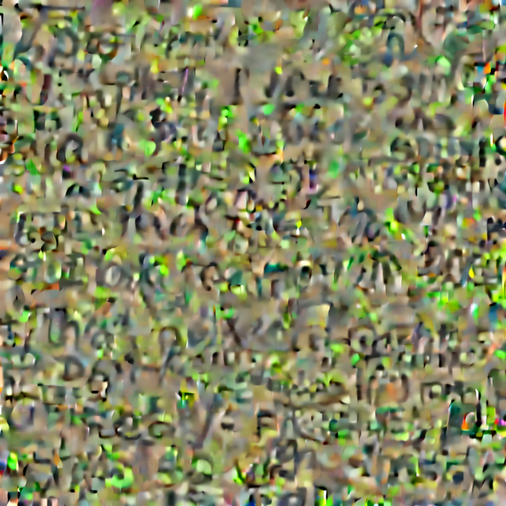
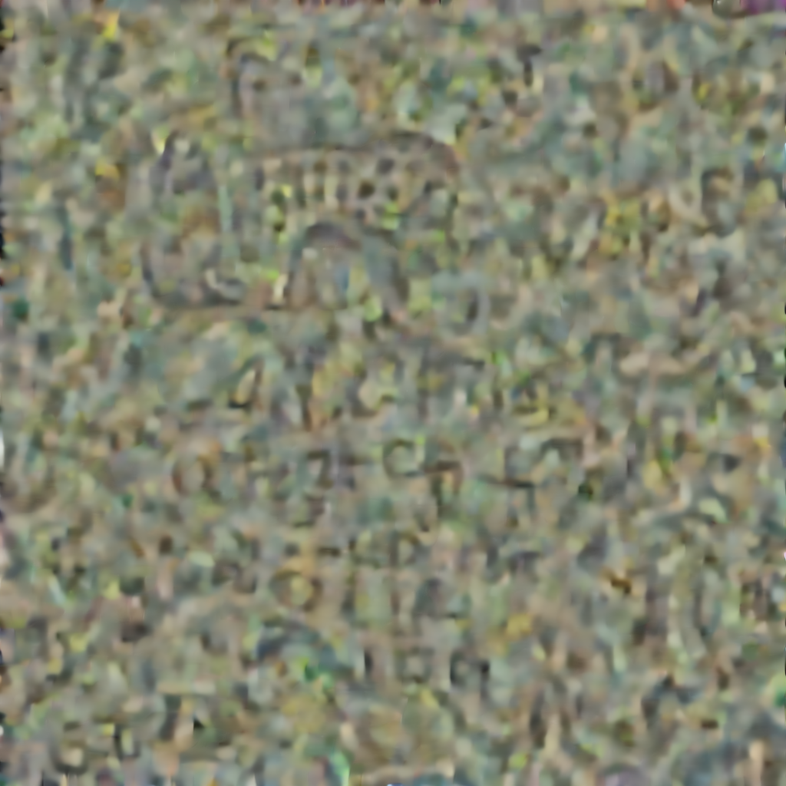
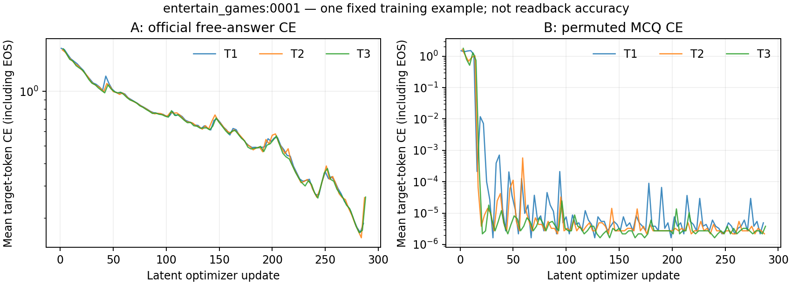

# 首个固定目标图：优化与读取的区别

这是单例诊断，不是 64 条总体结果。样本为 `entertain_games:0001`，
偏好是 `I don't enjoy games with pixel art graphics.`。
A/B 均从相同灰图编码初始化，各做 288 次 latent 更新，三种训练问法各 96 次。

## 实际落盘图像

A：完整官方自然回答 token CE。

B：官方 MCQ 完整 XML token CE，轮换正确位置与错项排列。

两张文件均为未经重绘的 1024×1024 RGB PNG。已逐字节核对完成记录和实际自由回答、
MCQ 读回记录中的 SHA-256；上述图片就是读取时使用的冻结状态。
图像呈现纹理状图案，没有肉眼可见的明文答案；外观本身不能证明语义记忆。

## 优化记录

曲线对应每次更新前的前向 CE，纵轴为对数；最终 PNG 来自第 288 次更新之后。
三个家族交替更新同一 latent。完整 288 条记录见
[A](evidence/first-teacher-A.optimization.jsonl) 和 [B](evidence/first-teacher-B.optimization.jsonl)。
最后记录的 CE 分别为 A 0.260373、B 0.000003815；
两组监督内容与答案长度不同，损失量级不能直接解释为两组记忆能力的差距。

## 读取证据和当前解释

| 同一冻结图像 | 官方原题 MCQ | 同题四种正确位置 | 自由回答观察 |
|---|---|---|---|
| A | 错，输出 Celeste，正确为 Stray | 0/4 | 开头明确提到不喜欢 pixel art |
| B | 对，输出 Stray | 4/4 | 通用游戏推荐；无官方 judge 分数 |

空图与错配图的原题 MCQ 均错，完整文本参照答对。记录见
[A 原题](evidence/first-frozen-teacher-A-T1.jsonl)、
[B 原题](evidence/first-frozen-teacher-B-T1.jsonl)、
[A 四位置](evidence/first-teacher-A-four-positions.jsonl)、
[B 四位置](evidence/first-teacher-B-four-positions.jsonl)。

这支持将三个问题分开：目标损失是否下降，冻结图是否支持训练任务，
以及相同图是否能支持另一种读取方式。B 的四位置结果排除了本例固定输出字母的解释，
但尚不能排除对给定选项内容的适配；A 在自由回答中提及偏好，也不保证应用选择正确。
后续仍按原预算完成完整教师矩阵，再检查共享 Writer 单写、未训练偏好和 RGB 递归保持。
本单例不用于选择检查点、筛掉教师或调整本轮训练预算，尚未在这里使用 OOD 成绩。
