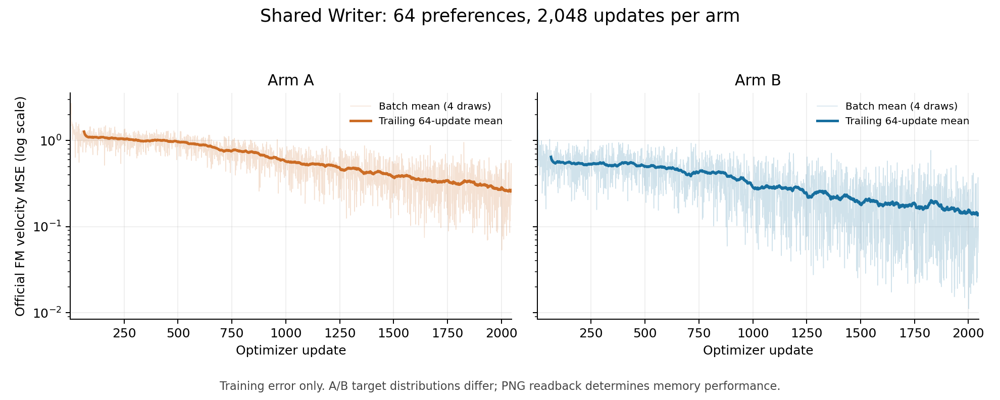

# 首段共享 Writer FM 已完成，PNG 读回尚待完成

2026-09-24。A/B 均按登记预算完成 2,048 次官方 FM 更新，随后自动启动原生
28 步、CFG=1 的 PNG 生成。当前能够确认训练正常执行且拟合误差下降，
尚不能据此确认共享 Writer 已学会可读取的偏好记忆。

| 项目 | A：完整自然回答教师 | B：MCQ 教师 |
|---|---:|---:|
| 完整教师数 | 64 | 64 |
| 连续且不重复的更新 | 2,048 | 2,048 |
| 有效 batch | 4 | 4 |
| 累计训练样本 | 8,192 | 8,192 |
| 每条偏好出现次数 | 128 | 128 |
| 前 128 次更新平均 MSE | 1.175410 | 0.592287 |
| 后 128 次更新平均 MSE | 0.267318 | 0.141103 |

图中淡线是每次更新的四样本平均，实线是过去 64 次更新的平均。
这是训练误差，不是冻结验证损失或准确率；A/B 的目标 latent 分布不同，
不能因为 B 的绝对 MSE 较小就判断其记忆更好。也没有因中间曲线改变预算或挑选终点。

两组使用同一 `4fbc857` 父检查点，官方 DreamLite 源码保持
`a6e20c8cc94027f37dd7c5a81b0b3b472aa18409`，本阶段执行实现仍为 `1c4aa2a`。
逐步记录已核对：每次四个样本，全部为初写位置 0；每个偏好恰好出现 128 次，
梯度范数和损失均有限；最终 checkpoint 的实际 SHA-256 与完成记录一致。
Reader 迁移到独立两卡实例期间，两个 Writer 训练进程没有重启。

完整记录、manifest、检查点哈希和统计见
[训练证据](evidence/write-training/write-training-verification.json)，
[A 原始轨迹](evidence/write-training/writer/A/write/optimization.jsonl)、
[B 原始轨迹](evidence/write-training/writer/B/write/optimization.jsonl)。
检查点保留在远端对应 `writer/{A,B}/write/checkpoint-final.pt`，未将大型权重提交到 Git。

下一步先读取同一固定终点生成的 pilot 64 条与 dev 90 条 PNG，每条各两条噪声链。
将教师可读性、训练偏好的蒸馏落差、未训练偏好写入分别报告；
再完成真实学生 RGB 前缀训练、重新生成的 0/5/10 保持链与 L1 覆盖。
完整自然回答尚待官方 judge，MCQ 不依赖该服务。
