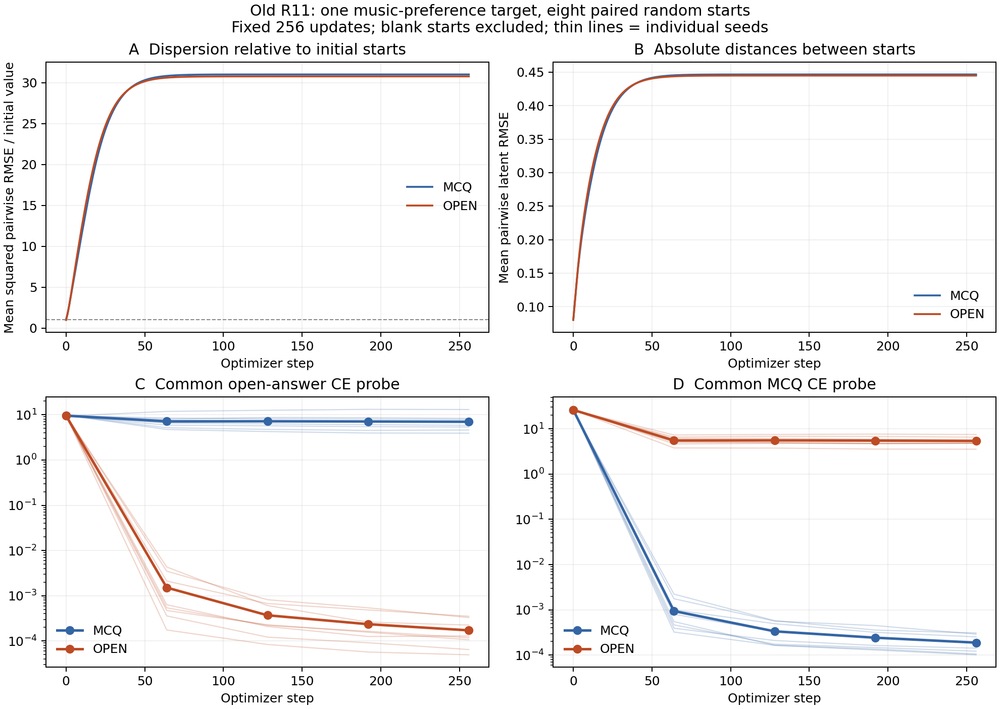
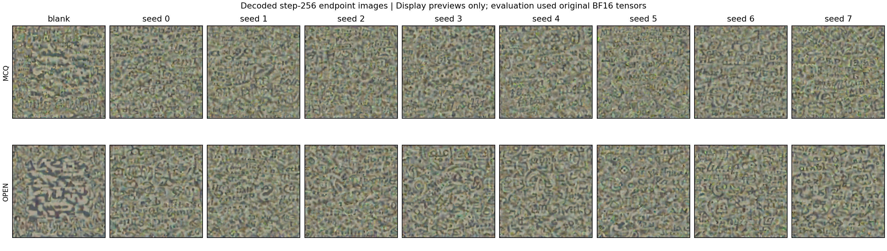

# DreamLite 旧 R11：无选项回放与配对多起点训练结果

实验日期：2026-09-07（北京时间）。状态：两阶段全部完成，独立原始产物核验通过。范围：旧 R11，直接优化 VAE latent；VAE 与 Qwen-Reader 权重全部冻结。

## 主要结论

**改为无选项短答能揭示旧选择题指标掩盖的问题，也让本题的直接回答有所改善，但本次实现尚不能稳定输出完整正确答案，更没有促使不同起点收敛到同一个 latent。**

1. 旧八个成功终点的选择题锚点全部复现，去掉选项后，匹配图片只在原问法下答对 3/8、改写问法下答对 4/8；blank 均为 0/8。
2. 在固定音乐偏好题（答案 `ambient`）上，八个配对随机起点经过开放短答训练后，原问法正确率从选择题训练的 0/8 提高到 3/8，两种问法都正确从 0/8 提高到 2/8。它仍是单题探索结果。
3. 两种目标下，起点间平均 RMSE 都从 0.0802 增至约 0.445，平均平方距离扩大约 31 倍。轨迹后期移动很小，但终点仍明显分离。
4. 本次开放目标只监督 `ambient` 的一个 token，**未监督 EOS**。全部八个随机终点在两种问法下都以 `ambient` 开始，但常继续生成其他词。命中答案词不能替代完整答案正确率。

## 实验设计与完成情况

第一阶段不重新训练。对旧 R11 的八个终点分别使用匹配图片、blank 图片、另一题的固定错配图片，在原问法和保持事实含义的改写问法下生成，共 48 条回答；另复现 32 个原选择题视角。

第二阶段事先固定 target index 1：`r5-f1-392d41fd097d069c42218e0a`，问题询问 `indigo desk train 001123` 当前偏好的音乐，标准答案为 `ambient`。此题在阶段一表现不好，但不是根据回放结果重新挑选的题。

每种训练目标均运行一个原始 blank 起点及八个随机起点，共 **18 次运行、4,608 次 Adam 更新**。每个随机起点为原 blank latent 加上 RMS 等于参考 latent RMS 的 10% 的高斯方向扰动。相同 seed 的两种目标使用逐位相同的初值。

| 项目 | 固定设置 |
|---|---|
| 可训练参数 | 仅 FP32 latent，形状 `[1,4,128,128]`，65,536 个坐标 |
| 模型 | DreamLite-mobile 的 AutoencoderTiny；Qwen3-VL-4B-Instruct Reader |
| 模型计算 | BF16，原 VAE 缩放/偏移和 Reader 预处理，两个 H200 |
| 优化器 | Adam，LR 0.05，固定 256 步，无提前停止或最佳检查点选择 |
| MCQ 训练 | 原四候选的 mean-token-NLL 所构成的 listwise CE，四种循环排列各 64 次 |
| Open 训练 | 无选项原问法下，gold 文本 token 的 teacher-forced CE；不附加 EOS |
| 生成 | 只有问题与图片，不提供 gold、选项或答案前缀；greedy，最多 32 个新 token |
| 评分 | 大小写/空白/末尾 Unicode 标点归一化后的完整精确匹配；不事后增加同义词 |
| 记录 | 每步 latent；0/64/128/192/256 的完整 Adam/RNG 检查点及固定探针 |
| 终点评测 | 108 条开放生成；72 个反向循环 MCQ 视角 |
| 固定探针 | 360 个正向循环 MCQ 视角、90 次开放 gold CE |

八个随机方向是独立初始化单位；blank 单独报告。28 对距离、多个时间点、问法、选项排列及重复控制输入都不增加独立样本数。

训练程序记录耗时 **2,965.2 秒（约 49.4 分钟）**，完成文件时间为北京时间 **2026-09-07 05:34:25**。新建 H200 实例已确认处于 STOPPED 状态。

## 第一阶段：旧终点无选项回放

| 图片条件 | 原问法 | 改写问法 |
|---|---:|---:|
| 该题优化后的匹配图片 | **3/8** | **4/8** |
| blank 图片 | 0/8 | 0/8 |
| 另一题的固定错配图片 | 0/8 | 1/8 |

旧选择题 32/32 正确，32 个 CE 与历史记录的最大绝对差为 **0**；八个终点重新解码得到的 BF16 图片与原始保存图片逐位一致。阶段一的结果差异不能归因于本次未复现旧评分路径。

| 标准答案 | 匹配图片：原问法原始回答 | 匹配图片：改写问法原始回答 |
|---|---|---|
| linen | wood | Linen |
| ambient | indigo | R3 Train Standard Templates 03 |
| orange | Yellow | Yellow |
| yellow | yellow | yellow |
| blue | White | White |
| juice | Juice | Juice |
| pasta | With one, food sort. | $11.00 |
| green | Green | Green |

两种问法均正确的题为 yellow、juice、green；linen 仅改写后正确。人工检查未发现需要把错误匹配回答改判为“事实正确、仅格式不符”的情况，主指标保持不变。48 条生成均未截断。

这增强了部分终点的读出不依赖候选提示的证据，同时表明选择题成功并不保证开放回答成功。错配图片改变了实体/属性，属于图像干预，并非已知正确反事实状态。全部原文与控制结果见 [回放详细报告](replay-9f86bc9-20260907-round01/analysis/report.md)。

## 第二阶段：两种目标的配对结果

以下均以八个随机起点为分母。

| 固定终点评测 | MCQ 训练 | Open 训练 |
|---|---:|---:|
| 无选项原问法完整正确 | 0/8 | **3/8** |
| 无选项改写问法完整正确 | 0/8 | **3/8** |
| 两种无选项问法都完整正确 | 0/8 | **2/8** |
| 四种 MCQ 反向排列全正确 | **8/8** | 0/8 |
| MCQ 视角级正确数（重复测量） | 32/32 | 3/32 |
| blank：两种无选项问法 | 均 0/8 | 均 0/8 |
| 固定 donor：两种无选项问法 | 均 0/8 | 均 0/8 |

原问法的配对差为 +3/8，跨问法同时正确的配对差为 +2/8。开放训练提高了本题在无选项格式下的完整回答成功数，但没有保持原选择题格式下的表现；不能将两种目标视为已经学到相同、与读出格式无关的表示。

开放训练的逐起点原始回答如下。seed 从 0 开始；blank 不纳入八个随机起点的正确率。

| 起点 | 原问法 | 改写问法 | 两问法都完整正确 |
|---|---|---|---|
| blank | ambient and electronic | ambient and electronic | 否 |
| 0 | ambient/ambient | ambient campfire | 否 |
| 1 | ambient hip hop | ambient | 否 |
| 2 | ambient | ambient | **是** |
| 3 | ambient | ambient 33 | 否 |
| 4 | ambient um silvertö | ambient um silver. | 否 |
| 5 | ambient | ambient | **是** |
| 6 | ambient trance | ambient trance | 否 |
| 7 | ambient the mindfull | ambient the mindful | 否 |

`ambient hip hop`、`ambient trance` 等加入了未经监督的额外内容，不能一概当作无害格式差异。`ambient/ambient` 是重复表达，也没有被事后放宽评分。Open 随机起点的 16 条回答均未截断，均以正确词开始；这只是诊断事实，**不是 16/16 的完整答案成功率**。整个第二阶段的 108 条生成有 1 条截断，发生在 MCQ 训练的 seed 3 改写问法，其完整原文与标记保存在 CSV 中。

blank 起点下，MCQ 训练的开放回答仍为 `indigo` / `R3 Train Standard Templates 03`，四个 MCQ 视角全正确；Open 训练为两次 `ambient and electronic`，开放完整回答与四视角全对标准均未通过。

全部 108 条生成见 [回答 CSV](multistart-analysis/answers.csv)。

## 不同起点是否收敛到同一位置

定义 `C(t)` 为八个随机起点的 28 对 latent **平方 RMSE 的均值**，以下比例是 `C(256)/C(0)`，不是 RMSE 本身的比例。

| 几何指标 | MCQ 训练 | Open 训练 |
|---|---:|---:|
| 初始平均两两 RMSE | 0.080224 | 0.080224 |
| 终点平均两两 RMSE | 0.446664 | 0.444967 |
| 平均平方距离相对初始值 | **31.006 倍** | **30.769 倍** |
| 各对 RMSE 相对自身初始距离的范围 | 5.437–5.738 倍 | 5.431–5.690 倍 |
| 终点 raw latent 平均余弦 | 0.763099 | 0.764148 |
| 相对各自起点的更新残差平均余弦 | **0.002319** | **0.003330** |
| 最后一步更新 RMS 范围 | 3.76e-6–6.70e-6 | 3.97e-6–1.95e-5 |

**在本次 256 步观察窗口内，起点间差异先扩大，随后趋于平台，没有出现终点合并。** 同组终点的 raw latent 余弦较高，但减去各自起点后，更新方向的平均余弦接近零。raw cosine 的共同底座不能被解读为相同更新方向。

同一个起点在两种目标下的终点 RMSE 为 0.3991–0.4286，余弦为 0.7847–0.8095。两种目标的整体距离曲线接近，也不意味着它们到达相同位置。

初始与最终距离矩阵的 Pearson 相关分别为 -0.470（MCQ）与 0.171（Open），仅作描述：28 对共享八条轨迹，而且初始距离高度集中，不能据此做独立样本显著性推断。

最后几步仍存在非零更新，故这里的“趋缓”不等于已经证明达到精确驻点；也未检验无限步极限、所有初始半径或全局唯一性。

图 A/B 展示扩散尺度；图 C/D 在每个子图中比较**相同评测目标**下两组 latent 的 CE。细线是八个随机起点，粗线是均值，不是置信区间。

## 从损失函数解释结果

MCQ 目标把四个候选的分数作相对归一化。Open 目标直接提高正确答案在完整词表下的概率，但两者的输入提示也不同。因此，这次比较的是两套读出目标与提示设置，不是单独某一个因素的完全因果分解。

本题 `ambient` 在当前 tokenizer 中是一个 token（ID 59614）。本次 Open 目标只优化 `-log p(ambient | q, image)`，没有优化下一步输出 EOS 的概率。它能让生成先出现 `ambient`，却没有直接约束模型随后停止。这与“目标词全部出现、完整精确匹配仅部分成功”的观察相容；是否由 EOS 监督不足导致，仍需下一组控制实验验证。

固定同一评测目标下的第 256 步平均探针值为：

| 相同探针 | MCQ 训练终点 | Open 训练终点 |
|---|---:|---:|
| 无选项 gold-token CE | 6.983713 | 0.000172 |
| 四正向 MCQ 视角平均 CE | 0.000189 | 5.390230 |

这里按行比较相同指标；不把不同定义的两种 CE 数字直接横向判优。

此外，**“loss 是标量且 latent 维数很高”本身不是非唯一性的数学证明**，例如平方范数也有唯一极小值。当前更有力的证据是实际配对轨迹：行为目标可以满足，而不同起点的终点依然显著分离。

## latent 分布是否相近

现有证据支持两种目标具有接近的宏观扩散尺度，以及接近的平均 raw cosine；它不证明终点采样分布相等。

下表先在每个终点内计算各通道的坐标均值和标准差，再分别取八个随机起点的平均。这里的标准差描述空间坐标的离散程度，不是均值的标准误或置信区间。

| 通道 | MCQ 坐标均值 | Open 坐标均值 | MCQ 坐标标准差 | Open 坐标标准差 |
|---|---:|---:|---:|---:|
| 0 | -0.688872 | -0.688519 | 0.318216 | 0.316856 |
| 1 | 0.519991 | 0.517348 | 0.321834 | 0.323271 |
| 2 | 0.420220 | 0.420134 | 0.350466 | 0.347634 |
| 3 | -0.576529 | -0.577544 | 0.320060 | 0.318369 |

**通道级边缘统计确实接近，但与逐坐标终点距离较大可以同时成立。** 这正是本批对“分布是否相近”最具体的回答：部分低阶统计相近，高维位置并未合并，联合分布是否相近尚未得到充分检验。

补充的坐标直方图是在单个 latent 内对空间坐标做统计，坐标彼此相关。即使直方图相似，也不能替代随机起点所诱导的高维联合分布比较，更不能说明空间排列、可解码信息或输出行为一致。本次按预注册不进行 MMD 或“分布相等”的假设检验。

可查看 [坐标直方图 PDF](multistart-figures/coordinate_histograms.pdf)及 [逐起点通道统计](multistart-figures/coordinate_statistics.csv)。直方图中的 blank 参考尖峰较高，细微组间差异以数值表为准。

上图仅为显示预览；模型评测始终使用原始 BF16 张量，没有使用缩略图或压缩图像替代输入。图像外观相似不能单独证明语义或 latent 相同。

## 技术核验与产物

训练程序的技术门已通过：所有运行均完成固定步数，模型快照起止一致，初始重复 forward/gradient 一致，完整生成与 MCQ 记录齐全。

独立 CPU 核验在原训练软件镜像内直接读取共享盘的完整产物，结果为 **passed=true**。共核验 18 次运行、4,608 条训练记录、4,626 个 latent 文件、90 个完整 Adam/RNG 检查点、450 个固定探针、108 条开放回答及 72 个终点 MCQ 视角。它从真实 latent 重算逐步更新及残差指标，并校验文件哈希、配对初值、终点与 step-256 一致性、严格原文重评分和控制条件重复一致性。

历史复现比较也通过：blank–MCQ 的 **256 步训练损失逐项完全相等，最终 latent 和解码图片逐位完全相等，终点 RMSE=0**。这是额外的描述性复现核验，不增加八个随机起点的样本量。

完整核验记录见 [audit JSON](multistart-full-audit.json)。独立审计没有重新运行 GPU 模型或重新计算每一步梯度；模型快照一致性与重复梯度结论依据相互校验的原始记录。临时核验 CPU 实例已停止，原有用户实例未被停止。

唯一失败尝试发生在第二阶段训练前：Git 将 Windows CRLF 换行为 Linux LF，导致预注册原文件哈希不匹配。该尝试耗时 0.0043 秒，没有加载模型或执行任何优化。修复仅允许换行符转换，实际源文件仍须严格匹配阶段一 manifest 的原始字节哈希；未改变题目、种子、目标、步数、评分或生成设置。失败记录保留。

| 产物 | 标识 |
|---|---|
| 第一阶段代码 | `9f86bc9b5752fa9a0c264ecee700a9f33497599b` |
| 第二阶段训练代码 | `5d06b7622a4f7081d02e42c656a97cffafe66207` |
| 核验与绘图代码 | `0fc0f21` |
| 代码分支 | `codex/r11-open-answer-20260907` |
| 第一阶段完整归档 SHA-256 | `e8651a445abd7a9197d19a2c007be7b28fd5fe74f9fe1e6eaec04617809664e3` |
| 第二阶段完整归档 SHA-256 | `800d13679f8a9ace4675cd844babc5d7dc5b845a985cbcda69257a5dc78b881f` |
| 第二阶段精简分析归档 SHA-256 | `3a6cf2fd6aa0148352e7d43da78b95470132347b5528141b36c69e2f384fe789` |

完整原始结果保存在共享盘：

`/inspire/ssd/project/exploration-topic/czxs26210936/runs/vision-language-memory-r11-open/multistart-5d06b76-20260907-round02`

本地分析包含 [汇总 JSON](multistart-analysis/analysis.json)、[逐对距离比](multistart-analysis/pair_distance_ratios.csv)、[逐起点几何指标](multistart-analysis/per_seed_geometry.csv)、[固定探针](multistart-analysis/fixed_probes.csv)及可导出的 [科学绘图 PDF](multistart-analysis/paired_multistart.pdf)。

本地已交付完整报告、全部文本评测/训练日志、分析 CSV、图片和核验结果。1.2 GB 的完整二阶段张量归档保留在共享盘，已完成全量文件核验；由于传输速度慢，完整归档的本地下载已中止，`.partial` 文件不是可用归档。该传输状态不影响上述独立核验或统计结果。

## 下一步建议

优先新增一个预先固定的 **gold + EOS** 开放目标对照，沿用同一题、相同八个起点和现有生成评测，检验能否消除续写问题。它需要作为新的实验条件报告，不能替换本批结果或事后放宽当前评分。

随后再增加题目和初始扰动半径，检查当前“先扩散、后趋缓”的几何规律是否保持。若继续研究信息保存，应增加独立事实/问题约束与未参与优化的读出检验；单纯增加答案长度不等于增加独立信息约束。本批尚未执行这些后续实验。
