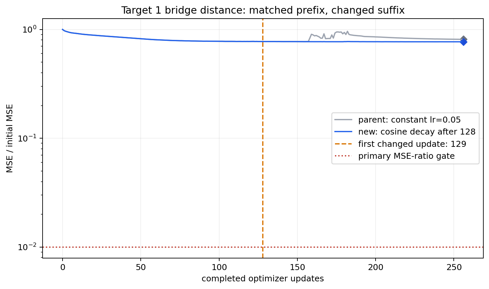
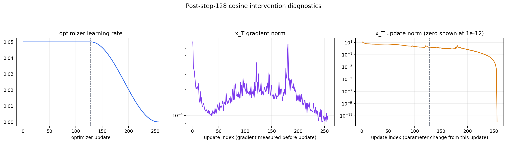
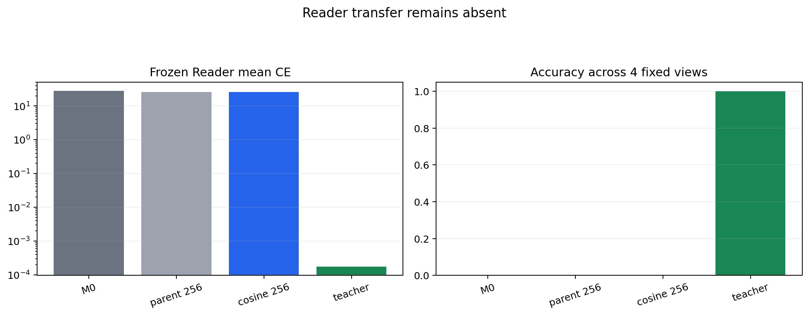
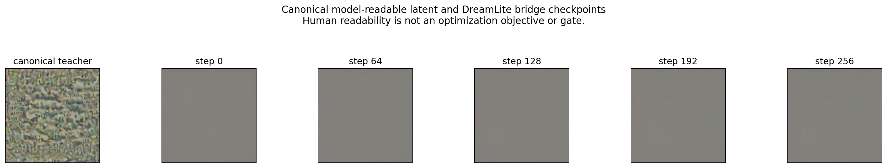

# R11_new 目标 1：后 128 步余弦学习率实验

## 一句话结论

实验工程有效，但主科学门控失败。余弦衰减消除了终点相对第 128 步的
MSE 反弹，却只把终点 MSE 比例从 0.81056 改善到 0.76961；
Reader 仍为 0/4。它支持“恒定学习率造成部分过冲”，不支持
“DreamLite 已能写入 R11 视觉码”。

## 实验身份

- 训练源码提交：`16318e005b496a16b7712ad4ff3cea50e2be34fa`
- 实例：`vlm-r3-h200x2-live-20260717`
- 目标：R11_new Phase1A 失败目标 1
- 唯一改变量：Adam 优化器学习率在第 128 步后余弦衰减至 0
- 未改变：数据、teacher、模型快照、初始化、四步 DreamLite 路径、
  latent MSE 目标、256 步预算、无梯度裁剪、Reader 评测与门槛
- 性质：单目标可达性诊断，不是共享 writer 训练

## 结果

| 指标 | 父实验：固定 lr | 本实验：后半程余弦 | 主门槛 |
|---|---:|---:|---:|
| 第 128 步 MSE/M0 | 0.773763 | 0.773763 | — |
| 第 256 步 MSE/M0 | 0.810562 | 0.769605 | <= 0.01 |
| 第 256 步 L2/M0 | 0.900312 | 0.877271 | <= 0.10 |
| teacher-normalized RMSE | 0.484533 | 0.472133 | <= 0.10 |
| Reader accuracy | 0/4 | 0/4 | 4/4 |
| Reader mean CE | 26.0938 | 25.5365 | 越低越好 |

Teacher 回放为 4/4、mean CE=0.000176906，证明固定 Reader 能读取目标
视觉码；当前 DreamLite 输出不能复现该码。

技术门控全部通过：256 条连续 receipt、每次四步 DreamLite、梯度均
有限且非零、仅 `x_T_fp32` 可训练、模型快照未改变、无梯度裁剪、
学习率逐步精确、Adam 内部终点计数为 256。
第 256 步学习率和实际参数更新量均为 0；诊断图为使用对数坐标而把该
零值显示在 `1e-12` 下限，不代表发生了非零更新。

## 因果证据

新旧实验前 128 条 receipt 除运行时间外逐字段完全相同，规范化字节流
SHA-256 均为
`001a486c946c456ff5e2e424f2b98f702a89aea30f99f49bda8e17c9f1fbea00`。
第 128 步的 `x_T`、终点 latent、五个轨迹张量、完整 Adam 状态和
PNG 哈希也全部相同。因此第 128 步后的差异可以归因于预注册的学习率
干预。

次级学习率假设审计通过：终点未反弹，且优于父实验终点。但它不能
挽救主门控失败，`formal_success=false`，Phase 2 继续阻塞。

图像是否“人类可读”从未进入目标函数。R11 teacher 呈现不可读纹理，
说明冻结 VLM 存在人类不敏感但模型可读的视觉方向；这可能是视觉编码，
也可能是模型/任务特定捷径。只有共享 writer 的固定数据、多种子、
ID/OOD 与因果 reset 评测通过后，才能上升为 Picture Memory 成功。

## 结论与下一步

1. 减轻学习率过冲不足以解除本次主要门槛失败。
2. 四步冻结 DreamLite 从随机 `x_T` 到目标 latent 的可达性与优化
   条件仍待进一步区分；终点仍保留初始 MSE 的 76.96%。
3. 按结果前决策表，下一轮保留本学习率计划，只能再改变一个因素：
   优化预算或初始化；不得调整门槛、挑选最佳检查点或放行 Phase 2。

## 完整产物

- `delivery-v1/technical-preflight.tar.gz`：预检、日志、模型/输入绑定和清单
- `delivery-v1/formal-target01.tar.gz`：256 receipts、5 个 checkpoint、
  图片、Reader 原始 logits、日志、环境与清单
- `delivery-v1/aggregation-v1.tar.gz`：独立复算结果
- `aggregation-v1/`：独立复算文件的直接副本
- `training_diagnostics.json`、`prefix_parity.json`：结构化摘要
- `ARCHIVE_SHA256SUMS.txt`、`DELIVERY_MANIFEST.json`：完整性清单

所有结论均来自原始 tensor、checkpoint、receipt 和 logits 的独立复算；
不采信训练器自报的 PASS 字段。
