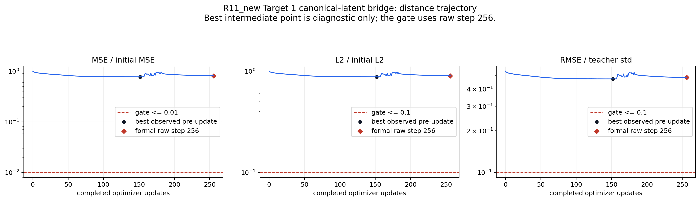
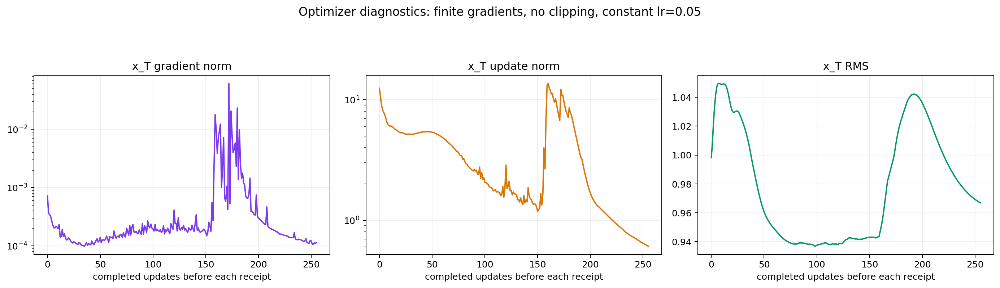
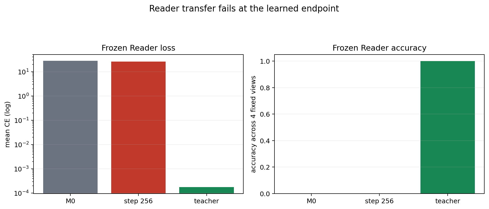
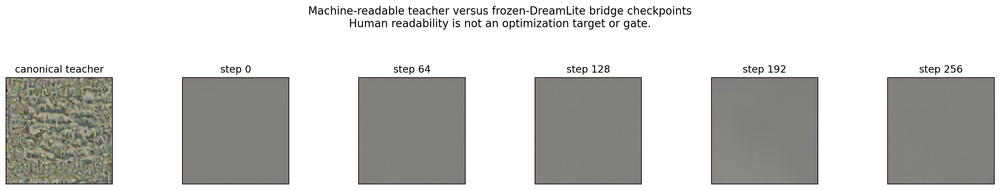

# R11_new canonical-latent bridge：Target 1 结果

## 核心结论

本轮实验已完整结束且工程链路有效，但 **bridge diagnostic gate 未通过**，不能声明科学成功，也不能进入 Phase 2。

已知可读的 canonical R11 latent 在冻结 Reader 上保持 `4/4` 正确、平均 CE `0.0001769061`。在完全冻结的 DreamLite 四步路径中，仅优化 `x_T_fp32` 256 步后，输出 latent 到 teacher 的 MSE 仅下降 `18.94%`，Reader 仍为 `0/4` 正确。因此，本轮排除了“本实验的 MSE→DreamLite→x_T 梯度完全断裂”和“teacher 本身不可读”，但不单独替代原QA损失链路的梯度结论，也没有证明 DreamLite 路径数学上不可达；它只证明当前 `Adam + constant lr=0.05 + 256 steps + seed 0` 求解设置未到达目标邻域。

## 锁定实验口径

- 固定目标：Phase 1A 最小失败目标 `target 1`，segment `r5-f1-392d41fd097d069c42218e0a`。
- 固定 teacher：R11 直接 VAE-latent oracle 的 `endpoint_raw.pt`。
- 仅改变的训练目标：Reader CE 改为 DreamLite endpoint 与 canonical teacher 的逐元素 FP32 MSE。
- 其余保持：冻结 DreamLite、VAE、Reader；仅训练 `x_T_fp32`；4个 DreamLite step；Adam；`lr=0.05`；无裁剪；256步；固定 seed 0。
- 正式端点固定为 raw step 256，禁止用最佳中间checkpoint补救结论。

## 结果

| 检查项 | 实测 | 预注册门槛 | 结论 |
| --- | ---: | ---: | --- |
| 技术预检 | 1 forward、1 backward、0 optimizer step | 全部满足 | PASS |
| Teacher replay | accuracy `1.0`，CE `0.0001769061` | accuracy `1.0`，CE `<=0.001` | PASS |
| 正式技术门槛 | 256个连续receipts，梯度每步非零，无裁剪 | 全部满足 | PASS |
| Endpoint MSE ratio | `0.8105616` | `<=0.01` | FAIL |
| Endpoint L2 ratio | `0.9003119` | `<=0.1` | FAIL |
| Endpoint teacher-normalized RMSE | `0.4845334` | `<=0.1` | FAIL |
| Endpoint Reader | accuracy `0.0`，CE `26.09376` | accuracy `1.0` | FAIL |
| Bridge gate | distance FAIL + Reader FAIL | 两者均通过 | FAIL |

checkpoint轨迹为：MSE ratio `1.0000 → 0.7977 → 0.7738 → 0.8639 → 0.8106`（step `0/64/128/192/256`）。它先下降、后反弹，说明信号能够回传并推动目标改善，但恒定步长下未稳定收敛到teacher邻域。

原始receipt记录的是“本次optimizer更新之前”的状态；距离图已将其对齐为“已完成更新数”，并用菱形单独标出正式raw step 256端点。中间最优点只用于诊断，不参与正式门槛。

## 下一步判别实验

保持目标、初始化、模型、数据、256步预算和全部门槛不变，只把学习率调度从 `constant` 改为预注册的单调衰减调度。该单因素实验用于检验后半程反弹是否由求解器步长造成；不得放宽阈值、不得启用最佳checkpoint、不得提前进入共享Writer或ID/OOD阶段。

## 完整交付

- `bridge-delivery-v1/technical-preflight.tar.gz`：完整预检目录，含输入绑定、teacher、step 0、模型快照、日志和终态。
- `bridge-delivery-v1/formal-target01.tar.gz`：完整正式目录，含256步metrics、5个checkpoint及图片、endpoint、评测行、日志和终态。
- `bridge-delivery-v1/aggregation-v1.tar.gz`：独立复算报告和原始产物索引。
- `aggregation-v1/`：从聚合归档逐字节验证后解出的GitHub可读结果。
- 图表与诊断文件由 `scripts/experiments/render_r11_new_canonical_latent_bridge_delivery.py` 从归档原始数据生成。

远端不可变结果根：

`/inspire/ssd/project/exploration-topic/czxs26210936/runs/vision-language-memory-r11-new/r11-new-bridge-f83519b-20260906-round01`
