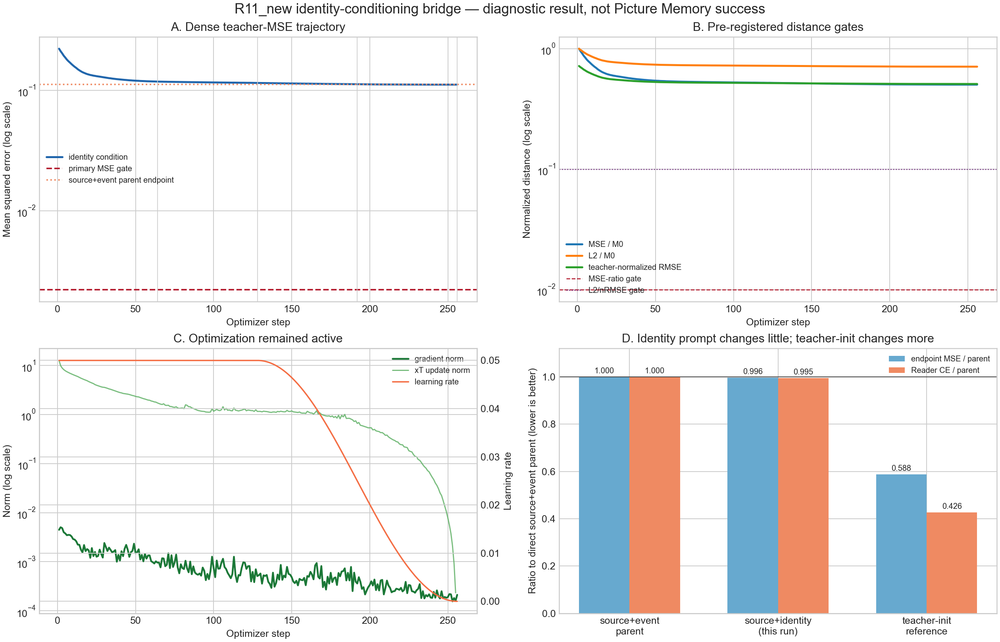
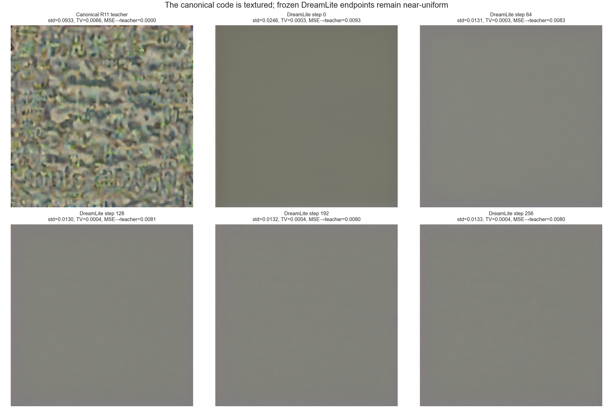

# R11_new identity-conditioning bridge：完整结果与结论

## 一句话结论

把冻结 DreamLite 的实际 conditioning 从原事件改成官方 identity 文本 `no changes`，只带来约 **0.40% 的 endpoint MSE 改善**和 **0.49% 的 Reader CE 改善**；raw step-256 仍远离 canonical R11 teacher，Reader 仍为 **0/4**。因此本轮技术执行有效，但科学主门与次级 bridge gate 均失败，不能称为 Picture Memory 成功，Phase 2 继续阻塞。

## 实验身份与不变量

- 协议：`R11-New-Identity-Conditioning-Bridge-Source-Init-Target01`
- 实现 commit：`5b8495128cc408c713e0d5c5d7e4486c12c518a9`
- 实例：`vlm-r11-identity-h200x4-20260907`；物理 4×H200，运行时固定 `CUDA_VISIBLE_DEVICES=0,1`，其余两卡未参与。
- 唯一改变：conditioning 文本由原事件改成 `no changes`。
- 保持不变：target-01、source-only `x_T` 初始化、canonical teacher、四步 sigma 路径、Adam、256 step、前 128 步固定 LR 后 cosine、无梯度裁剪、raw256 主终点、四个 reverse-cyclic Reader views 与全部阈值。
- 本轮仍由 per-target canonical teacher 的 dense MSE 监督，只是单目标机制诊断；不是共享 writer、event-to-state 学习、ID/OOD 或全量训练。

## 预注册门槛与真实结果

| 指标 | 门槛 | 结果 | 判定 |
| --- | ---: | ---: | --- |
| 技术合同 | 全部成立 | 256/256 receipts；5 个 checkpoint；模型冻结；全程有限非零梯度；无裁剪 | 通过 |
| Teacher replay | 4/4 且 mean CE ≤ 0.001 | 4/4；CE `0.0001769061` | 通过 |
| MSE / M0 | ≤ 0.01 | `0.5032259955` | 失败 |
| L2 / M0 | ≤ 0.10 | `0.7093842369` | 失败 |
| teacher-normalized RMSE | ≤ 0.10 | `0.5096492255` | 失败 |
| Endpoint Reader | 4/4 | 0/4；mean CE `25.64063823` | 失败 |
| Picture Memory 正式成功 | 不由本诊断开放 | `false` | 不成立 |
| Phase 2 | 主门通过才开放 | `false` | 继续阻塞 |

M0 MSE 为 `0.2212174237`；raw256 MSE 为 `0.1113223583`，训练把误差降低了约 49.68%，但仍比预注册 MSE 门槛高约 50 倍。Reader 从本轮 M0 的 CE `27.69792577` 改善到 `25.64063823`，仍没有一个排列答对。

## 与直接父臂的严格比较

直接父臂是相同 source-only 初始化、相同训练合同、但使用原事件 conditioning 的实验。

| 指标 | 原事件父臂 | `no changes` 本轮 | 改善 |
| --- | ---: | ---: | ---: |
| endpoint MSE | `0.1117721573` | `0.1113223583` | `0.0004497990`（0.402%） |
| Reader mean CE | `25.76563760` | `25.64063823` | `0.12499937`（0.485%） |
| Reader accuracy | 0/4 | 0/4 | 0 |

预注册的次级“双指标严格改善”条件成立，说明 conditioning 确实有微弱影响；但 bridge diagnostic 仍为 `false`，因为两个主门都失败。这个结果只能把“错误 prompt 是主因”降级，不能把微小改善包装成训练成功。teacher-matched 初始化参考的 MSE/CE 为 `0.06570045 / 10.97591`，变化远大于换 prompt，但它直接利用 teacher，不能成为可用 writer。

## 曲线与图片现象

- 前约 30–60 步快速下降，之后进入长平台；到 cosine 尾部仍有非零梯度，不是梯度裁剪造成的停止。
- 最小梯度范数为 `1.5584e-4`，最小非零梯度比例为 `0.99893`；反向链路存在，但有效下降方向越来越弱。

- canonical teacher 是高纹理、模型可读的人类不可读视觉码，PNG 像素标准差 `0.0933`、total variation `0.00656`。
- DreamLite step256 仍近似均匀灰图，标准差 `0.0133`、total variation `0.000414`；与 teacher 的纹理结构明显不同。
- 这与 latent 距离平台和 Reader 0/4 一致：优化改变了 `x_T`，但冻结 DreamLite 的输出仍停留在低纹理区域。

## 第一性原理归因

现有证据排除了“没有梯度”“被 clip 截断”“Reader/teacher 本身无效”“只是原事件 prompt 把方向带偏”等主要解释。当前更符合的候选根因是：

1. **可达集合/局部几何不匹配。** canonical R11 teacher 是直接优化 VAE latent 得到的视觉码，不保证属于固定 conditioner 下冻结 DreamLite 映射 `F_c(x_T)` 容易到达的集合。
2. **初始化与 basin 影响显著。** teacher-matched 初始化明显优于 source-only，但仍不达门槛，说明起点重要，却不足以单独解决问题。
3. **冻结生成器自由度可能不足。** 仅优化 `x_T` 能把 MSE 减半，但不能重建 teacher 的高纹理结构；下一步需要先区分“优化器连可实现目标也拟合不了”与“canonical teacher 对冻结模型不可实现”。

最小下一步应是一个 **self-generated reachable-target 正对照**：固定同一 conditioner 和冻结 DreamLite，先由一个预先锁定的 `x_T*` 生成 `z*=F_c(x_T*)`，再从原 source-only `x_T` 用完全相同的 256-step 优化合同拟合 `z*`。若该正对照通过而 canonical teacher 失败，才有依据进入 LoRA/适配生成器；若正对照也失败，应先修复优化/Jacobian 条件，而不是扩大数据或直接全量训练。该实验必须另行在看到其结果前锁定目标构造、非平凡性检查、门槛与代码。

## 完整交付

- 独立复算：[comparison.json](aggregation/comparison.json)、[RAW_ARTIFACTS.json](aggregation/RAW_ARTIFACTS.json)、[distance_trajectory.csv](aggregation/distance_trajectory.csv)、[独立报告](aggregation/REPORT.md)
- 核心证据：[256-step metrics](evidence/metrics.jsonl)、[Reader 原始行](evidence/evaluation_rows.jsonl)、[技术门](evidence/technical_gate.json)、[formal terminal](evidence/formal-controller-terminal.json)、[环境](evidence/environment.txt)、[运行时](evidence/runtime.json)
- 渲染数据：[rendered_summary.json](evidence/rendered_summary.json)、[image_statistics.csv](evidence/image_statistics.csv)、[渲染脚本](render_results.py)
- 本地交付清单：[DELIVERY_MANIFEST.json](DELIVERY_MANIFEST.json)；列出除自身外 30 个文件的字节数与 SHA-256。
- 原始图片：`images/`
- 全部 72 个远端文件（含所有 checkpoint、tensor、日志、condition/initialization 证据）位于 `raw/r11-new-identity-condition-5b84951-20260907-round01.tar.gz`。
- 归档 SHA-256：`7e1734c707682f1d4b93bf15978c02f3f9f7dec0ea5e62dc909752a91816130f`；解包后 `SHA256SUMS` 已逐文件验证 72/72 通过。

所有“通过”均区分为工程门、teacher replay、次级敏感性与科学主门；本轮没有把任何中间 checkpoint、微小指标改善或人类不可读图片误报成 Picture Memory 成功。
