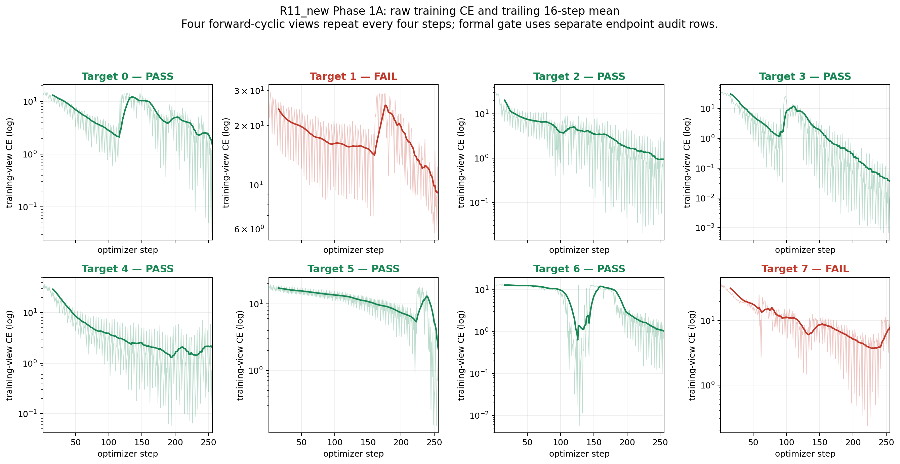
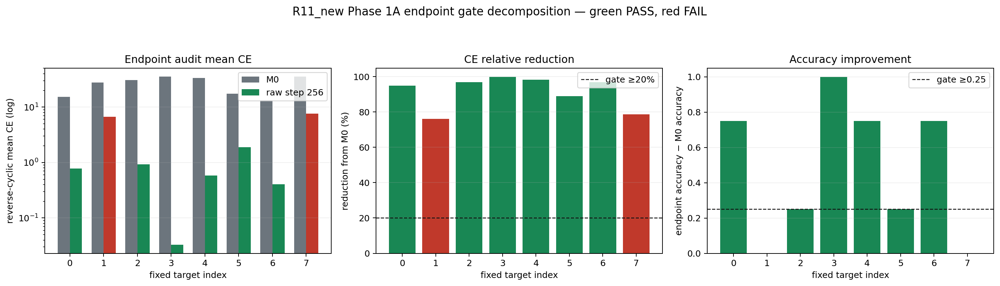
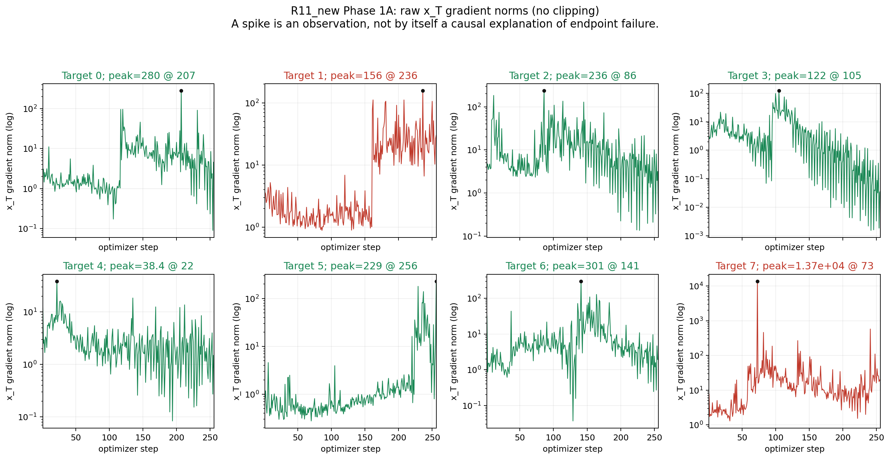
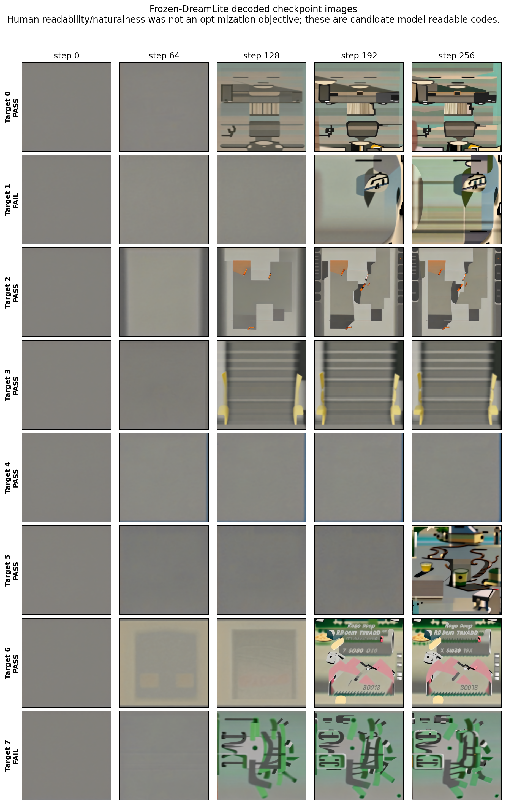

# R11_new Phase 1A 最终交付：工程 8/8，诊断 6/8

> 日期：2026-09-05
> 训练源码：`2cde77ece6f020ab8c747d7c73e19dac4d8fba1b`
> 实例：`vlm-r3-h200x2-live-20260717`，2 × H200
> 正式运行根：`/inspire/ssd/project/exploration-topic/czxs26210936/runs/vision-language-memory-r11-new/r11-new-phase1a-2cde77e-20260905-round02`

## 1. 一句话结论

完整冻结 DreamLite 链路可反向传播且能为 8 个固定 query 中的 6 个找到 Reader 可读 endpoint，但没有达到预注册的 8/8 Phase 1A 门槛；`formal_success=false`，Phase 2 不得启动，下一步必须执行 canonical-R11 latent 的 bridge-distance 最小判别实验。

这不是完整数据训练，也不是共享 Picture Memory writer 的成功结果；它只是 8 个固定 F1 query 的全链路可达性诊断。

## 2. 实验到底训练了什么

```text
唯一可训练的 FP32 x_T
    -> 完整且冻结的 DreamLite 四步推理
    -> endpoint latent z_t
    -> 冻结 VAE Decoder
    -> 冻结 Qwen3-VL-4B Reader
    -> query-level choice CE
```

锁定配置：

- 8 个预注册 F1 target，每个 target 独立优化一个 `x_T`；
- DreamLite、condition encoder、VAE、Reader 全部冻结；
- effective sigmas：`[0.5, 0.375, 0.25, 0.125]`；
- Adam，learning rate `0.05`，weight decay `0`，constant schedule；
- seed `0`，每个 target `256` optimizer steps，不做 gradient clipping；
- 四个 forward-cyclic training views，每个 view恰好出现 64 次；
- checkpoint：`0, 64, 128, 192, 256`；
- primary endpoint：原始 step 256，禁止事后选择 best checkpoint；
- endpoint 用四个独立 reverse-cyclic choice views 审计，并保留 normal/reset 因果对照。

总计保存并独立复算 `2,048` 条连续 optimizer receipts 与 `128` 条 endpoint evaluation rows。8 个有效 target 的 controller wall-clock 合计 `3,736.772` 秒（`62.280` 分钟），nearest-rank p90 为 `473.723` 秒/target。

## 3. 预注册门槛与结果

每个 target 必须同时满足 exact technical gate、endpoint CE 相对 M0 至少下降 20%、四个审计 views 全部改善、accuracy 至少提高 0.25，以及 `DiD(normal, reset) < 0`。

| Target | Gate | M0 CE | Endpoint CE | CE 下降 | 改善 views | Accuracy Δ | Normal/reset DiD |
| ---: | --- | ---: | ---: | ---: | ---: | ---: | ---: |
| 0 | PASS | 15.283861 | 0.779338 | 94.90% | 4/4 | +0.750 | -14.504523 |
| 1 | **FAIL** | 27.921883 | 6.691034 | 76.04% | 4/4 | **+0.000** | -21.230850 |
| 2 | PASS | 30.807291 | 0.933170 | 96.97% | 4/4 | +0.250 | -29.874121 |
| 3 | PASS | 35.333333 | 0.032681 | 99.91% | 4/4 | +1.000 | -35.300652 |
| 4 | PASS | 33.348958 | 0.579022 | 98.26% | 4/4 | +0.750 | -32.769935 |
| 5 | PASS | 17.406250 | 1.898205 | 89.09% | 4/4 | +0.250 | -15.508044 |
| 6 | PASS | 13.312504 | 0.407325 | 96.94% | 4/4 | +0.750 | -12.905179 |
| 7 | **FAIL** | 35.604166 | 7.600396 | 78.65% | 4/4 | **+0.000** | -28.003770 |

- 工程门：`8/8 PASS`；
- query-level reachability：`6/8 FAIL`；
- 失败目标：`[1, 7]`；
- 聚合决策：`run_canonical_r11_latent_bridge_distance_diagnostic`；
- Phase 2：禁止启动；
- 科学成功：`false`。

正式独立复算报告见 [`phase1a-aggregation-v1/REPORT.md`](phase1a-aggregation-v1/REPORT.md)，机器可读结果见 [`comparison.json`](phase1a-aggregation-v1/comparison.json) 和 [`RAW_ARTIFACTS.json`](phase1a-aggregation-v1/RAW_ARTIFACTS.json)。

## 4. Loss 图应如何解释



- 浅色线是每一步真实 `training-view CE`，深色线只是 trailing 16-step mean；没有替换原始值。
- 四种 training choice view 每四步循环一次，因此规则性波动不等于随机数据噪声。
- 多个通过目标出现“先进入低 loss 区域、随后被较大梯度推出、后来再恢复”的非单调轨迹。
- Target 1 和 7 的 CE 明显下降，但 step 256 的正确答案概率仍没有超过错误选项，accuracy 没跨过门槛。
- 训练 loss 不是正式 endpoint gate；正式结论来自固定 raw step 256 的独立 reverse-cyclic rows。



全部目标都满足 CE 下降门；真正失败项是 Target 1、7 的 accuracy improvement 仍为 0。不能因为连续 CE 变好便把它们改判为成功。

## 5. 梯度现象



- 所有 2,048 步的 `x_T` 梯度均 finite、nonzero，证明全链路反向传播有效。
- Target 7 在 step 73 出现最大 raw gradient norm `13,704.203`；同一步 Adam 参数更新 norm 为 `10.600`，整轮最大更新反而是 step 1 的 `12.798`。
- 目前只能记录为尖锐 loss landscape 的候选现象，不能把 raw gradient 峰值直接等同参数爆炸，也不能据此事后加入 clipping。
- 下一实验仍先做 bridge-distance；是否改 clipping/LR 必须由后续新预注册单因素实验决定。

## 6. “人类不可读图片”具体意味着什么



图片并非始终是纯随机噪声：step 0/64 多为近灰色，step 128–256 逐渐出现房间状结构、旋转文字/符号、卡通或几何纹理。但这些图像没有提供人类可稳定解码的 entity/value 语义。

本轮目标只有“冻结 Reader 对目标 choice 的 CE”，没有自然图像、文本可读性、语义对齐或人类感知约束。优化器因此可以利用 VLM 敏感而人类不敏感的视觉方向形成模型特定 code。

严格解释边界：

- 通过目标说明冻结 Reader 在固定审计 views 下能从 endpoint 取得目标答案；
- normal/reset DiD 支持正常更新路径具有因果作用；
- 但这仍可能是 query/Reader-specific code，而不是状态语义；
- 人类不可读本身既不是失败，也不是成功证据；
- 尚未证明跨 query、跨模型、held-out、OOD、长期递归、OVERWRITE/CLEAR 或共享 writer 能力。

## 7. 第一性原理归因与下一步

已有证据排除了“完全没有梯度”和“冻结 Reader 完全无法读取任何视觉 code”。Target 1/7 的 4/4 CE 均改善且 reset 对照不支持无条件图片假阳性，但 accuracy 未跨过离散决策边界。

仍待区分：

1. **路径可达性问题**：冻结 DreamLite 在锁定预算内不能充分逼近已知可读 latent；
2. **QA 优化问题**：可读 latent 位于可达集合内，但 choice CE landscape、固定 Adam `0.05` 或 raw endpoint 不稳定。

下一项只改变 objective：固定 canonical R11 已知可读 teacher `z_R11*`，其余 target、初始化、DreamLite 路径、optimizer、LR、步数、checkpoints 与 raw endpoint 均保持不变，优化：

```text
MSE(Phi_DL(x_T; previous_state, event), z_R11*)
```

若能逼近 teacher，优先归因 QA objective/optimization；若不能，只能说明该已知 code 在锁定预算下没有被该路径到达，不能声称所有可读 code 均不存在。

## 8. 完整产物与不可变映射

Target 1 首次目录 `target-01` 因两个手抄 snapshot hash 多出字符，在模型加载及 optimizer step 0 前 fail-closed。该技术失败原样保留、不计入科学结果；有效重试为 `target-01-retry01`。独立聚合通过不可变 source map 将 Target 1 绑定到该 retry。

| 分卷 | 字节 | 条目 | SHA-256 | 内容 |
| --- | ---: | ---: | --- | --- |
| `aggregation-v1.tar.gz` | 43,814 | 4 | `64d0cf0d...12a8ac` | 正式独立聚合 |
| `targets-00-01-retry.tar.gz` | 23,366,402 | 90 | `67582d05...17a89b` | T0、T1 零步失败、T1 有效重试 |
| `targets-02-03.tar.gz` | 22,745,949 | 84 | `06fc9632...f0663` | T2、T3 完整 artifacts |
| `targets-04-05.tar.gz` | 21,873,812 | 84 | `1051dba9...ac4af` | T4、T5 完整 artifacts |
| `targets-06-07.tar.gz` | 24,568,404 | 84 | `238ddf1f...4f44c` | T6、T7 完整 artifacts |

每个有效 target 的归档包含 launch/terminal、stdout/stderr、环境、manifest、模型 snapshot 起止验证、256-step metrics、五个 checkpoints、五张图片及哈希、raw endpoint tensor/image、16-cell evaluation rows、technical gate、summary、报告与 artifact inventory。

完整哈希见 [`ARCHIVE_SHA256SUMS.txt`](ARCHIVE_SHA256SUMS.txt)；归档/映射/图表的字节与 SHA 清单见 [`DELIVERY_MANIFEST.json`](DELIVERY_MANIFEST.json)。逐目标 CSV 与训练统计分别为 [`per_target_results.csv`](per_target_results.csv) 和 [`training_diagnostics.json`](training_diagnostics.json)。

关键聚合哈希：

- selected 8-target payload：`6198beb3a3758fd7df912c6956bc05eac0ace8603708f37147826c65a4d61845`；
- aggregate raw-artifacts：`c1e36f92766c98f245917a9009dc9061a07729842dbef6c7b97ad18889edfbba`。

## 9. 本地复核

```bash
sha256sum -c reports/r11-new-phase1a-results-20260905/ARCHIVE_SHA256SUMS.txt
python scripts/experiments/render_r11_new_phase1a_delivery.py
```

绘图命令会再次校验分卷字节、SHA、成员安全性、条目数、8 × 256 receipts、四步 DreamLite/no-clip 契约及正式聚合结论，再从原始归档生成 CSV、指标图和图片拼图。

## 10. 不允许越界表述

本轮不能声称：R11_new 成功、Picture Memory 成功、共享 writer 已训练、完成全量数据、state/transition memory、ID/OOD 泛化、多 seed 稳定性、长期 recurrence、OVERWRITE/CLEAR 或人类不可读视觉协议已经被可靠学习。
