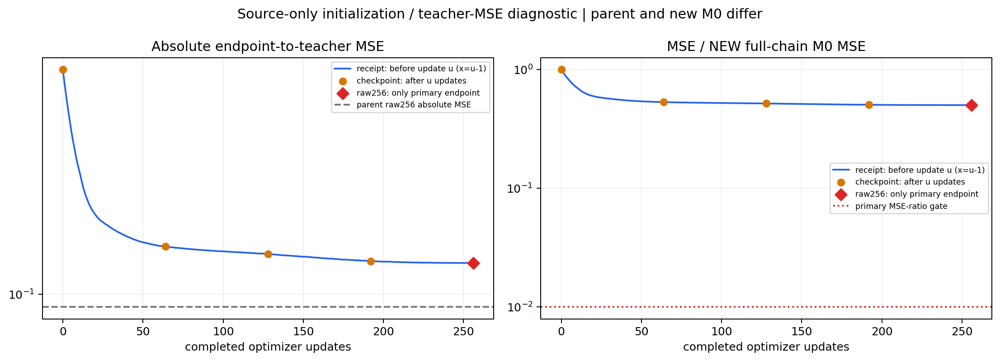
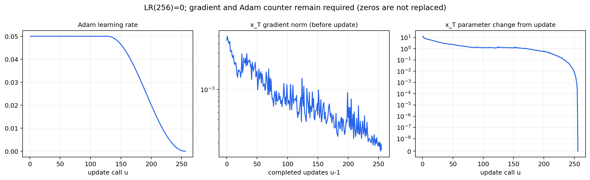
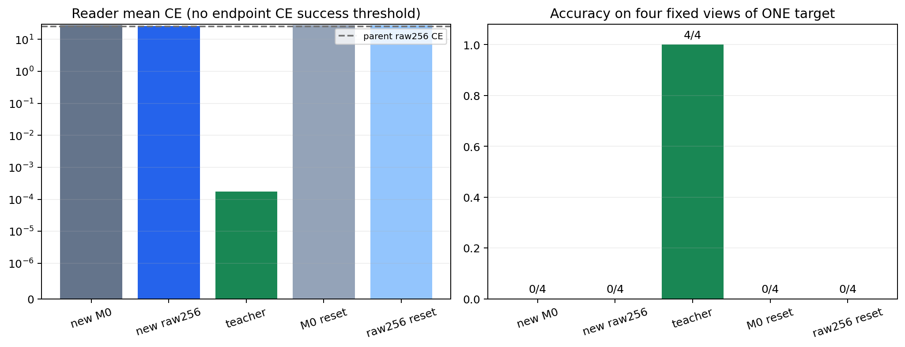
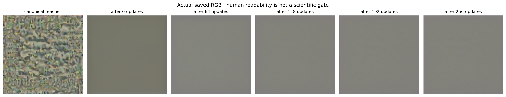

# R11_new：Source-only initialization 真实结果

训练锁定提交：`e0a43c43f893ac19c6976ecd4c84ea3dc2b23006`。固定 target 1，唯一干预是使用固定 source latent 初始化 xT；初始化不接收 teacher、query 或答案；完整四步 DreamLite 保持冻结，只优化 FP32 xT。

## 结论边界

工程门：**通过**；teacher replay：**通过**；距离门：**失败**；Reader 门：**失败**；本轮 bridge 诊断：**失败**。

本轮初始化不使用 teacher，但优化目标仍使用 canonical teacher 的 MSE 标签。无论诊断结果如何，`formal_success=false`、`phase2_allowed=false`。Phase 1A 仍为 **6/8**；不能将本轮 target 1 或 canonical R11 结果拼入主线通过数，也不能声称长期 memory/shared writer 已学会。

## 实际门槛与结果

| raw256 指标 | 本轮真实值 | 固定门槛 |
| --- | ---: | --- |
| MSE / 新 M0 MSE | 0.5021907948 | ≤ 0.01 |
| L2 / 新 M0 L2 | 0.7086542139 | ≤ 0.1 |
| RMSE / teacher population std | 0.5106778087 | ≤ 0.1 |
| Reader accuracy | 0/4 | 4/4 |
| Reader mean CE | 25.7656376 | 原样报告，不新增 endpoint CE 成功阈值 |

四视图是同一个 target 的固定排列，并非四个独立样本。仅 raw256 判主门；中间 checkpoint、最低 train loss、二级改善均不能挽救主门失败。

## 真实训练轨迹

Receipt 第 u 行的 loss 在更新前测量，横坐标为 u−1；checkpoint 保存更新后 endpoint，横坐标为 u。新 M0 是新初始化完整跑完四步后、零更新的 endpoint，不是初始 flow state 或 teacher。父实验具有不同 M0，因此只画父实验绝对 MSE 参考线，不作同分母比值对比。

| 已完成更新数 | checkpoint MSE | MSE / 新 M0 | teacher NRMSE |
| --- | ---: | ---: | ---: |
| 0 | 0.222569108 | 1 | 0.7206304552 |
| 64 | 0.11845503 | 0.532216852 | 0.5257229343 |
| 128 | 0.1153617427 | 0.5183187537 | 0.5188132674 |
| 192 | 0.1124825999 | 0.5053828041 | 0.512298215 |
| 256 | 0.1117721573 | 0.5021907948 | 0.5106778087 |

真实 receipts 共 256 行。Adam 前 128 次学习率 0.05，之后按锁定 cosine 曲线衰减；第 256 次学习率为零，但仍须有有限非零梯度与第 256 次 Adam 计数。图中零值保持为零。

图像仅展示保存的真实 RGB；人类可读性不是本实验优化目标或门槛。

## 二级审计与下一项决策

主决策：`distance_fail_reader_fail_change_one_solver_factor`。

二级决策：`distance_fail_reader_fail_secondary_init_not_improve`。资格 eligible=`true`，通过 passed=`false`。

二级仅在技术/teacher 有效且两主门均失败时参与解释，要求 endpoint MSE 严格小于父值 `0.09553645551204681`，且 Reader CE 严格小于父值 `25.536474171257463`。只改善一项或相等均不通过，二级不是成功门。

| 距离 / Reader | 另行预注册的候选下一项 |
| --- | --- |
| 通过 / 通过 | 同一 source-only 初始化下的原始 QA solver，并完整重验固定八成员 |
| 通过 / 失败 | teacher 邻域 Reader 鲁棒性 |
| 失败 / 通过 | 原始 QA 目标诊断 |
| 失败 / 失败且二级通过 | 单因素 conditioning 诊断 |
| 失败 / 失败且二级未通过 | 单因素 conditioning 诊断，不据此否定全部初始化 |

这些是需新预注册的候选，不是此配置内追加实验许可。source-only 初始化的一次改善不证明它是主导根因；失败不证明全部答案无关初始化失败或数学不可达。

## 证据与复核范围

Preflight 为一次完整四步前向、一次反向、零更新，不评判 bridge 结果。源目录 inventory、聚合 comparison/RAW 及所有绑定文件字节已检查；本地另从原始 checkpoint tensor 复算距离并按既定容差核验，从原始四选项 logits 复算 CE/正确率，并对原始聚合指标重算主次决策。

所有表格、图表和展示字段统一使用已哈希绑定的原始 record/聚合统计。FP32 reduction 在不同平台或线程实现下可能出现末位差异；本地 CPU 复算值仅用于原有严格容差校验，单独保存在 `checkpoints[*].local_cpu_recomputed_distance_statistics`，不替换远端原值、不改变科学门槛。机器可读文件同时保留两组明确标注的数值。

CUDA 初始化与每 checkpoint 起点闭包由独立 CUDA aggregator 核验。本渲染器仅核对其证据文件字节，不在 CPU 上伪装重跑 CUDA 逐位算术。只有 step 0 的 xT 要与固定 source 精确相等，其余起点由各自当前 xT 决定；原生 mul-add 重建必须匹配实际 trajectory point 0，不假定其与 source 逐位相等。不要求旧 Gaussian M0 或旧优化前缀相等。

逐行学习率的精确合同由原 Linux 运行环境的独立 aggregator 验证并以文件哈希绑定。Windows/Linux 的 cosine 库可产生极小末位差异，渲染器不以另一平台的重算替换原始学习率，也不放宽原有门槛；图表保留原 receipts 数值。

机器可读数据：[training_diagnostics.json](training_diagnostics.json)；逐行原始 Reader 数据和带明确前后坐标的 receipts/checkpoints 均在其中。交付文件哈希：[DELIVERY_MANIFEST.json](DELIVERY_MANIFEST.json)。
