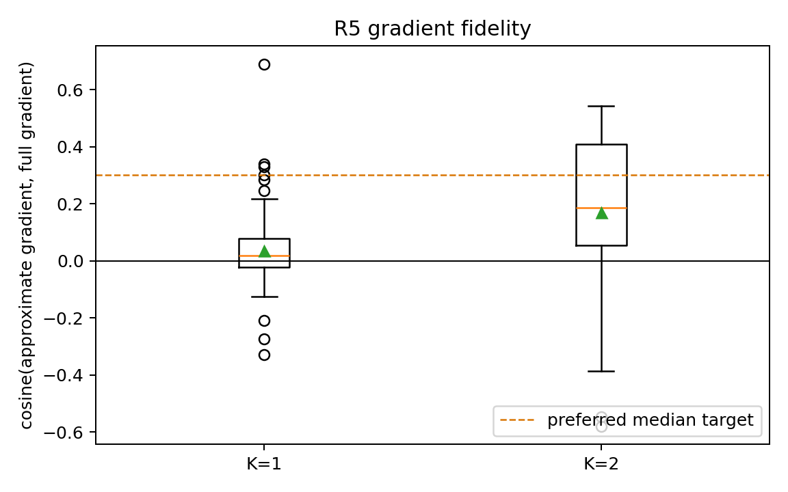
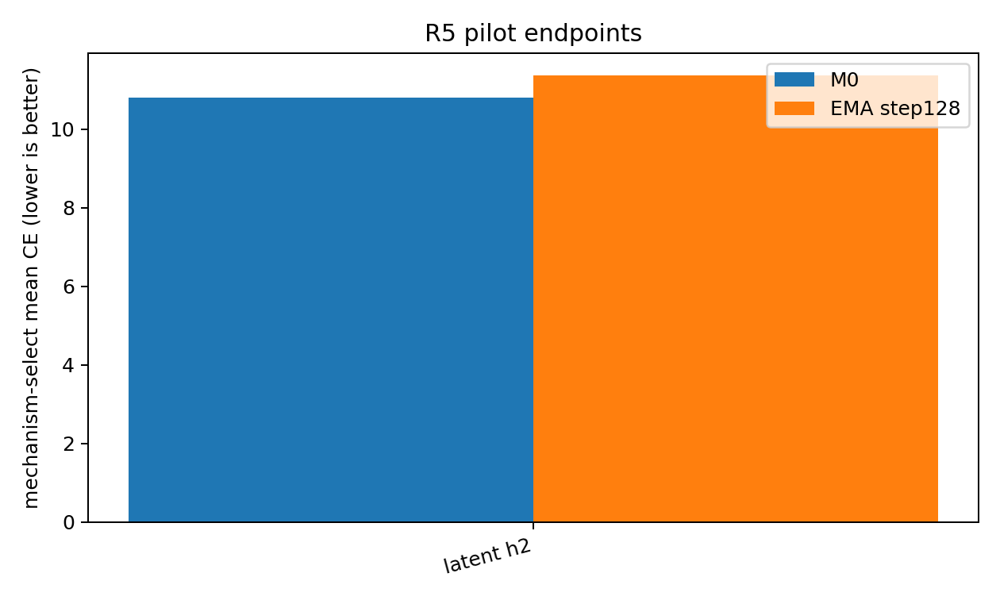
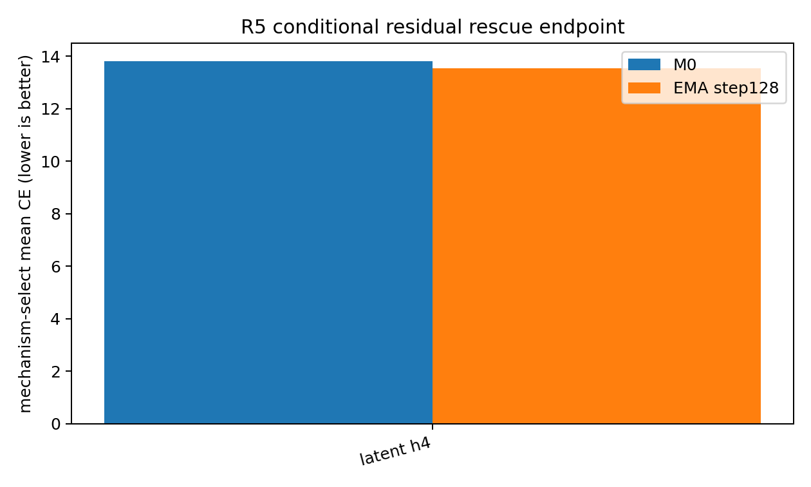
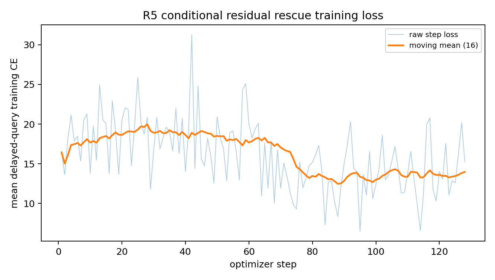

# R5-Compose 最终实验报告

> 固定目标：检验多步视觉状态能否保持、早期写入能否获得未来查询梯度，以及 latent persistence 是否减少 RGB/VAE 往返损伤。

## 结论先行

四臂或主线未形成可接受胜者，已按预注册规则完成 latent+h4、τ=0.5 residual rescue；结果应解释为机制诊断，而非正向记忆证明。

## 1. 固定方法

- DreamLite-mobile U-Net 仅训练 rank-4 LoRA；Qwen3-VL-4B Reader 与 DreamLite 基座冻结。
- `drtune_stateful`：selected U-Net step 保留状态输入梯度，非 selected step 不计算参数梯度，scheduler 仍在 autograd 内。
- TBPTT 只在 segment 边界 detach；比较 h=2 与 h=4。
- NOOP 返回同一个 Tensor，不调用 DreamLite、不使用 identity loss。
- 噪声只由 global seed、source episode ID、source turn ID 决定。
- 训练课程为 F1–F6，640 optimizer steps × 8 micro-segments = 5,120 个组合段。
- AdamW，clip=10，16-step 线性 warmup 后 cosine decay；EMA=0.995，主 endpoint 固定为 EMA step640。

## 2. 梯度 fidelity 与设备拓扑

- 梯度决策：`fallback_full_gradient`；selected-step count：`0`。
- 设备决策：`single_h200_parallel_arms`。

| 近似 | median cosine | positive fraction | median norm ratio |
| --- | --- | --- | --- |
| K1 | 0.0179 | 0.5833 | 0.0021 |
| K2 | 0.1851 | 0.7708 | 0.0107 |

## 3. Pilot 结果

| Arm | M0 delayed CE | Endpoint delayed CE | ΔCE | Normal−Reset | 技术门 | 机制门 | 秒 |
| --- | --- | --- | --- | --- | --- | --- | --- |
| latent + h2 | 10.8113 | 11.3637 | 0.5524 | -9.3884 | PASS | FAIL | 3542.2 |

预注册胜者：`无合格胜者`。

## 4. 条件 residual rescue

该分支仅用于诊断 τ=0.5 是否缓解状态大面积重写，不作为主线正向结果。

| Arm | M0 delayed CE | Endpoint delayed CE | ΔCE | Normal−Reset | 技术门 | 机制门 | 秒 |
| --- | --- | --- | --- | --- | --- | --- | --- |
| latent + h4 | 13.7966 | 13.5234 | -0.2732 | -7.2288 | PASS | PASS | 3398.1 |

## 5. 主训练与最终因果评测

主训练未进入完整固定 endpoint 评测；见 conditional rescue。

### 全运行优化诊断

| Run | steps | first-16 loss | last-16 loss | median preclip grad | clip rate | median update/weight |
| --- | --- | --- | --- | --- | --- | --- |
| pilot-latent-h2-full | 128 | 17.4908 | 13.0420 | 2240.7701 | 1.0000 | 0.000647 |
| rescue-latent-h4-k0-tau05 | 128 | 18.1995 | 13.9615 | 1499.4949 | 1.0000 | 0.000615 |

## 6. 状态图片与可解释性边界

每个最终评测目录都包含 `state_examples/index.json` 以及 F1–F6 的初始/中间/最终图片。图片是否人类可读不是本实验成功标准；核心证据是固定 Reader 的 CE、状态干预和配对 bootstrap。

## 7. 严谨解释

- 正向结论只有在多 seed endpoint 改善且 Normal 显著优于 Reset/Cross-swap 时才成立。
- train loss 下降本身不能证明状态被使用；因果对照是必要条件。
- 本轮只评估 ID dev 与受控 mechanism dev，不主张 OOD、跨 Reader 或闭源 API 泛化。
- F1–F6 最长为 3 次 updater；因此原方案中的 gap-4 tie-break 实际退化为最长可观察 gap=3，这一偏差已在 pilot selection 中显式记录。
- hard NOOP 是机制隔离，不代表生成式 updater 已学会 NOOP。

## 8. 运行 provenance

| Run | Git | State | h | Gradient | τ | Train SHA | Dev SHA |
| --- | --- | --- | --- | --- | --- | --- | --- |
| gradient-audit-latent-h4 | b02a41126e50 | latent | 4 | drtune_stateful | 1.0 | 24327edc39e0 | 8b167df38022 |
| pilot-latent-h2-full | b02a41126e50 | latent | 2 | full | 1.0 | 24327edc39e0 | 8b167df38022 |
| rescue-latent-h4-k0-tau05 | ba1303a35dd5 | latent | 4 | full | 0.5 | 24327edc39e0 | 8b167df38022 |
| smoke-resume-same-latent-h4 | b02a41126e50 | latent | 4 | drtune_stateful | 1.0 | 24327edc39e0 | 8b167df38022 |
| smoke-same-latent-h4 | b02a41126e50 | latent | 4 | drtune_stateful | 1.0 | 24327edc39e0 | 8b167df38022 |
| smoke-split-latent-h4 | b02a41126e50 | latent | 4 | drtune_stateful | 1.0 | 24327edc39e0 | 8b167df38022 |
| topology-same-latent-h4 | b02a41126e50 | latent | 4 | drtune_stateful | 1.0 | 24327edc39e0 | 8b167df38022 |
| topology-split-latent-h4 | b02a41126e50 | latent | 4 | drtune_stateful | 1.0 | 24327edc39e0 | 8b167df38022 |
